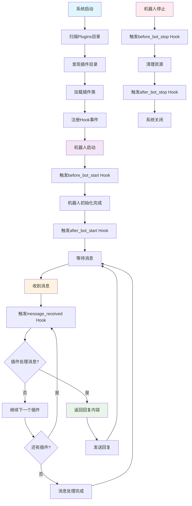
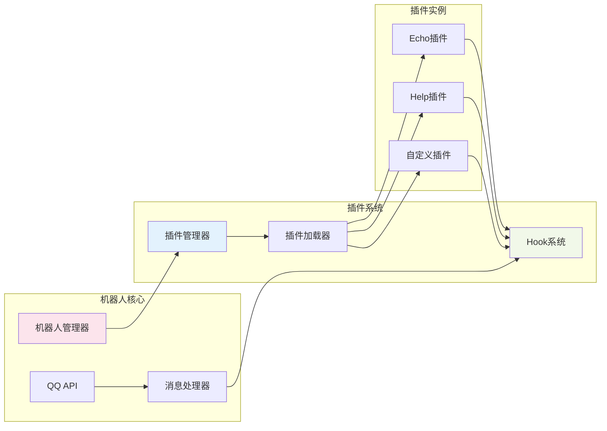

# 🔌 QQ机器人插件开发文档

欢迎使用QQ机器人插件系统！本文档将指导您开发功能强大的机器人插件。

## 🆕 新功能亮点

### 🎉 多消息回复支持

现在插件可以在一次回复中发送多条不同类型的消息！

```python
# 🆕 新功能：一次发送多条消息
return {
    'response': [
        MessageBuilder.text('📊 查询结果'),
        MessageBuilder.text_card('详细数据...'),
        MessageBuilder.markdown('## 分析报告\n...'),
        MessageBuilder.text('✅ 查询完成')
    ],
    'handled': True
}
```

### 🔢 插件优先级系统

插件现在支持优先级设置，控制执行顺序！

```python
class Plugin(BasePlugin):
    def __init__(self):
        super().__init__()
        self.priority = 5  # 数字越小优先级越高，默认为10
```

### 🔄 继续执行机制

插件可以处理消息后允许其他插件继续处理！

```python
return {
    'response': MessageBuilder.text('我处理了，但其他插件也可以处理'),
    'handled': True,
    'continue': True  # 允许其他插件继续处理这条消息
}
```

**主要优势：**

- ✅ **丰富表达** - 组合不同消息类型，提供更好的用户体验
- ✅ **智能排序** - 插件按优先级执行，重要功能优先处理
- ✅ **灵活控制** - 支持插件链式处理和继续执行机制
- ✅ **完全兼容** - 现有插件无需修改，新旧语法并存

## 🔄 插件系统工作流程



## 🏗️ 插件架构图



## 📋 目录

- [插件架构](#插件架构)
- [快速开始](#快速开始)
- [Hook系统](#hook系统) 🆕 **支持多消息回复**
- [消息构建器](#消息构建器)
- [插件工具](#插件工具) 🆕 **HTML渲染工具**
- [插件示例](#插件示例) 🆕 **包含多消息示例**
- [最佳实践](#最佳实践) 🆕 **多消息使用指南**
- [调试指南](#调试指南)
- [常见问题](#常见问题) 🆕 **多消息FAQ**

## 🏗️ 插件架构

### 核心概念

我们的插件系统采用**Hook驱动 + 命令发现**的混合架构：

- ✅ **Hook驱动** - 所有插件功能通过Hook事件触发
- ✅ **命令发现** - 插件可以注册命令信息，用户可以查看命令列表
- ✅ **自主解析** - 插件内部处理命令解析和消息处理
- ✅ **完全隔离** - 插件之间互不干扰
- ✅ **灵活响应** - 可处理任何类型的消息和事件

### 插件目录结构

```
Plugins/
├── your_plugin/           # 插件目录
│   ├── __init__.py       # 插件主文件（必需）
│   ├── config.py         # 配置文件（可选）
│   ├── utils.py          # 工具函数（可选）
│   └── README.md         # 插件说明（推荐）
├── echo/                 # 示例插件
└── help/                 # 帮助插件
```

## 🚀 快速开始

### 1. 创建插件目录

```bash
mkdir Plugins/my_plugin
cd Plugins/my_plugin
```

### 2. 创建插件主文件

创建 `__init__.py` 文件：

```python
"""
我的第一个插件
"""
from Core.plugin.base import BasePlugin
from Core.logging.file_logger import log_info
from Core.message.builder import MessageBuilder


class Plugin(BasePlugin):
    """我的插件类"""

    def __init__(self):
        super().__init__()

        # 插件信息
        self.name = "MyPlugin"
        self.version = "1.0.0"
        self.description = "我的第一个QQ机器人插件"
        self.author = "Your Name"
        self.priority = 10  # 插件优先级，数字越小优先级越高

        # 注册命令信息（用于展示和帮助）
        self.register_command_info('hello', '打招呼', '/hello')
        self.register_command_info('info', '显示插件信息', '/info')

        # 注册Hook事件处理器
        self.hooks = {
            'message_received': [self.handle_message_hook],
            'before_bot_start': [self.on_before_bot_start_hook],
            'after_bot_start': [self.on_after_bot_start_hook],
            'before_bot_stop': [self.on_before_bot_stop_hook],
            'after_bot_stop': [self.on_after_bot_stop_hook]
        }

        log_info(0, f"{self.name}插件初始化完成", "PLUGIN_INIT", plugin=self.name)

    def handle_message_hook(self, message_data, bot_id=None):
        """处理消息Hook"""
        try:
            content = message_data.get('content', '').strip()

            # 处理命令
            if content.startswith('/'):
                return self._handle_command(content, bot_id)

            # 处理自然语言
            if content.lower() in ['hello', '你好']:
                return {
                    'response': MessageBuilder.text(f'你好！我是{self.name}插件 👋'),
                    'handled': True
                }

            # 不处理其他消息
            return {'handled': False}

        except Exception as e:
            log_info(bot_id or 0, f"{self.name}插件处理消息异常: {e}", "PLUGIN_ERROR")
            return {'handled': False}

    def _handle_command(self, content, bot_id=None):
        """处理命令"""
        # 解析命令
        parts = content[1:].split()
        if not parts:
            return {'handled': False}

        command = parts[0].lower()
        args = parts[1:] if len(parts) > 1 else []

        # 处理支持的命令
        if command == 'hello':
            return {
                'response': MessageBuilder.text(f'你好！我是{self.name}插件 👋'),
                'handled': True
            }
        elif command == 'info':
            # 🆕 多消息回复示例
            return {
                'response': [
                    MessageBuilder.text(f'📋 {self.name} 插件信息'),
                    MessageBuilder.text_card(
                        text=f'插件名称：{self.name}\n版本：{self.version}\n作者：{self.author}',
                        description=self.description,
                        prompt='插件详细信息'
                    ),
                    MessageBuilder.text('✨ 感谢使用！')
                ],
                'handled': True
            }

        return {'handled': False}

    def on_before_bot_start_hook(self, bot_id, bot_config):
        """机器人启动前Hook"""
        return {'message': f'{self.name}插件准备为机器人 {bot_id} 初始化'}

    def on_after_bot_start_hook(self, bot_id, bot_config):
        """机器人启动后Hook"""
        return {'message': f'{self.name}插件已为机器人 {bot_id} 准备就绪'}

    def on_before_bot_stop_hook(self, bot_id):
        """机器人停止前Hook"""
        return {'message': f'{self.name}插件准备为机器人 {bot_id} 清理资源'}

    def on_after_bot_stop_hook(self, bot_id):
        """机器人停止后Hook"""
        return {'message': f'{self.name}插件已为机器人 {bot_id} 清理完成'}
```

### 3. 重启机器人

重启机器人服务，插件将自动加载。

### 插件加载机制

#### 自动发现

系统会自动扫描 `Plugins/` 目录下的所有子目录：

- **目录要求**：必须是目录（不是文件）
- **命名要求**：不能以 `__` 开头（如 `__pycache__`）
- **文件要求**：必须包含 `__init__.py` 文件
- **类要求**：`__init__.py` 中必须有 `Plugin` 类

#### 默认插件

系统会自动加载以下默认插件：

- `echo` - 回声插件
- `help` - 帮助插件

#### 插件生命周期

```python
# 1. 插件发现
plugins = plugin_manager.discover_plugins()

# 2. 插件加载
for plugin_name in plugins:
    plugin_manager.load_plugin(plugin_name)

# 3. Hook注册
# 系统自动注册插件的hooks到Hook系统

# 4. 插件卸载（可选）
plugin_manager.unload_plugin(plugin_name)

# 5. 插件重载（可选）
plugin_manager.reload_plugin(plugin_name)
```

#### 插件状态管理

```python
# 获取插件信息
plugin_info = plugin_manager.get_plugin_info('my_plugin')

# 获取所有插件
all_plugins = plugin_manager.get_all_plugins()

# 检查插件是否加载
is_loaded = 'my_plugin' in plugin_manager.plugins
```

## 🎣 Hook系统

### 可用的Hook事件

| Hook事件                | 触发时机      | 参数                              | 返回值                                                                    |
|-----------------------|-----------|---------------------------------|------------------------------------------------------------------------|
| `message_received`    | 收到消息时     | `message_data, user_id, bot_id` | `{'response': MessageBuilder对象或数组, 'handled': bool, 'continue': bool}` |
| `message_not_handled` | 没有插件处理消息时 | `message_data, user_id, bot_id` | `{'response': MessageBuilder对象或数组, 'handled': bool, 'continue': bool}` |
| `before_bot_start`    | 机器人启动前    | `bot_id, bot_config`            | `{'message': str}` (可选)                                                |
| `after_bot_start`     | 机器人启动后    | `bot_id, bot_config`            | `{'message': str}` (可选)                                                |
| `before_bot_stop`     | 机器人停止前    | `bot_id`                        | `{'message': str}` (可选)                                                |
| `after_bot_stop`      | 机器人停止后    | `bot_id`                        | `{'message': str}` (可选)                                                |

### Hook执行顺序

🆕 **Hook现在按插件优先级执行！**

```python
# 执行顺序示例
SecurityPlugin (priority=1)     # 最先执行
AdminPlugin (priority=5)        # 然后执行
EchoPlugin (priority=10)        # 接着执行
StatsPlugin (priority=50)       # 再执行
HelpPlugin (priority=100)       # 最后执行
```

### Hook返回值详解

```python
# 完整的Hook返回值格式
return {
    'response': MessageBuilder.text('回复内容'),  # 可选：回复消息
    'handled': True,                            # 必需：是否处理了消息
    'continue': False                           # 🆕 可选：是否允许其他插件继续处理
}

# 简化格式（向后兼容）
return {'handled': False}  # 没有处理消息，让其他插件处理
```

### message_data 结构

```python
message_data = {
    'content': '消息内容',           # 消息文本
    'type': 'c2c',                 # 消息类型: c2c(私聊), channel(频道), group_at(群聊@)
    'id': 'message_id',            # 消息ID
    'msg_id': 'message_id',        # 消息ID（用于回复）
    'timestamp': '2025-01-01...',  # 时间戳
    'author': {                    # 发送者信息
        'user_openid': 'user_123',
        'id': 'author_id',
        'username': 'user_name'    # 用户名（如果有）
    },
    # QQ频道消息额外字段
    'channel_id': 'channel_123',   # 频道ID（仅频道消息）
    'guild_id': 'guild_456',       # 服务器ID（仅频道消息）

    # 群聊消息额外字段
    'group_openid': 'group_123',   # 群聊ID（仅群聊消息）

    # 原始事件数据（用于高级处理）
    'raw_event': {...}             # 完整的QQ事件数据
}
```

### 消息类型说明

- **`c2c`** - 单聊消息（私聊）
- **`channel`** - 频道消息
- **`group_at`** - 群聊@消息
- **`direct_message`** - 私信消息
- **`at_message`** - 公域频道@消息

### 获取消息信息的最佳实践

```python
def handle_message_hook(self, message_data, bot_id=None):
    """安全地获取消息信息"""
    # 安全获取消息内容
    content = message_data.get('content', '').strip()

    # 安全获取消息类型
    msg_type = message_data.get('type', 'unknown')

    # 安全获取发送者信息
    author = message_data.get('author', {})
    user_id = author.get('user_openid') or author.get('id', 'unknown')
    username = author.get('username', '未知用户')

    # 根据消息类型获取特定信息
    if msg_type == 'group_at':
        group_id = message_data.get('group_openid')
    elif msg_type == 'channel':
        channel_id = message_data.get('channel_id')
        guild_id = message_data.get('guild_id')

    # 处理消息...
    return {'handled': False}
```

### Hook返回值规范

#### message_received Hook

```python
# 🆕 单条消息回复
return {
    'response': MessageBuilder.text('单条回复内容'),
    'handled': True
}

# 🆕 多条消息回复
return {
    'response': [
        MessageBuilder.text('第一条消息'),
        MessageBuilder.markdown('## 第二条消息\n这是Markdown格式'),
        MessageBuilder.image('https://example.com/image.jpg', '第三条图片消息')
    ],
    'handled': True
}

# 🆕 继续执行机制
return {
    'response': MessageBuilder.text('我处理了这条消息'),
    'handled': True,
    'continue': True  # 允许其他插件继续处理这条消息
}

# 🆕 混合类型多消息回复
return {
    'response': [
        MessageBuilder.text('📊 数据查询结果：'),
        MessageBuilder.text_card(
            text='详细数据内容...',
            description='数据卡片',
            prompt='点击查看详情'
        ),
        MessageBuilder.text('✅ 查询完成！')
    ],
    'handled': True,
    'continue': False  # 默认值，处理后停止其他插件
}

# 没有处理消息，让其他插件处理
return {'handled': False}

# 处理了消息，但不回复
return {'handled': True}
```

#### message_not_handled Hook

🆕 **新增Hook**: 当没有插件处理消息时触发，通常用于提供帮助信息或兜底处理。

```python
def handle_message_not_handled(self, message_data, user_id, bot_id):
    """处理未知命令"""
    content = message_data.get('content', '').strip()

    # 提供帮助信息
    if content:
        return {
            'response': [
                MessageBuilder.text(f'❓ 未知命令: {content}'),
                MessageBuilder.text('📚 输入 "help" 查看可用命令')
            ],
            'handled': True
        }

    return {'handled': False}

# 注册Hook
self.hooks = {
    'message_received': [self.handle_message],
    'message_not_handled': [self.handle_message_not_handled]  # 🆕 新Hook
}
```

#### 其他Hook

```python
# 返回状态消息
return {'message': '操作完成'}

# 或者返回空
return {}
```

### Hook系统高级特性

#### 🆕 优先级执行机制

Hook现在按插件优先级顺序执行，实现更精确的控制：

```python
# 执行流程示例
用户发送: "hello"

1. SecurityPlugin (priority=1)
   → 检查安全性 → continue: True

2. AdminPlugin (priority=5)
   → 检查管理员权限 → continue: True

3. EchoPlugin (priority=10)
   → 处理echo命令 → handled: True, continue: False (停止)

4. HelpPlugin (priority=100)
   → 不会执行（因为EchoPlugin已处理并停止）
```

#### 🆕 智能消息流控制

系统支持两阶段消息处理：

1. **第一阶段**: `message_received` Hook按优先级执行
2. **第二阶段**: 如果没有插件处理，触发 `message_not_handled` Hook

```python
# 第一阶段：常规处理
class EchoPlugin(BasePlugin):
    def __init__(self):
        self.priority = 10

    def handle_message(self, message_data, user_id, bot_id):
        if message_data.get('content', '').startswith('echo '):
            return {'response': '...', 'handled': True}
        return {'handled': False}  # 不处理，进入第二阶段

# 第二阶段：兜底处理
class HelpPlugin(BasePlugin):
    def __init__(self):
        self.priority = 100

    def handle_not_handled(self, message_data, user_id, bot_id):
        return {
            'response': MessageBuilder.text('❓ 未知命令，输入help查看帮助'),
            'handled': True
        }
```

#### 频率限制

Hook系统内置了频率限制机制，防止插件滥用：

- **限制规则**：每个插件每分钟最多触发10次Hook
- **自动跳过**：超过限制的Hook调用会被自动跳过
- **日志记录**：频率限制触发时会记录警告日志

```python
# 插件开发者无需特殊处理，系统自动管理频率限制
def handle_message_hook(self, message_data, user_id, bot_id):
    # 正常编写处理逻辑即可
    return {'response': '处理结果', 'handled': True}
```

#### 错误处理

Hook系统具有完善的错误处理机制：

- **异常捕获**：插件Hook执行异常不会影响其他插件
- **错误日志**：详细记录异常信息和堆栈
- **继续执行**：一个插件出错不会阻止其他插件处理

```python
def handle_message_hook(self, message_data, bot_id=None):
    try:
        # 您的处理逻辑
        return self.process_message(message_data)
    except Exception as e:
        # 异常会被Hook系统自动捕获和记录
        # 建议在插件内部也进行适当的错误处理
        return {'handled': False}
```

#### 插件间通信

可以通过自定义Hook事件实现插件间通信：

```python
# 插件A：触发自定义事件
class PluginA(BasePlugin):
    def some_method(self):
        # 通过插件管理器触发自定义Hook
        from Core.bot.manager import get_bot_manager
        bot_manager = get_bot_manager()
        bot_manager.plugin_manager.trigger_hook('custom_data_update', {'data': 'some_value'})


# 插件B：监听自定义事件
class PluginB(BasePlugin):
    def __init__(self):
        super().__init__()
        self.hooks = {
            'custom_data_update': [self.handle_data_update]
        }

    def handle_data_update(self, data):
        # 处理来自其他插件的数据
        print(f"收到数据更新: {data}")
```

## 📝 消息构建器

### MessageBuilder 概述

MessageBuilder是QQ机器人系统的核心消息构建工具，提供了统一的消息格式化接口。它支持多种消息类型，确保插件能够发送各种格式的消息。

### 导入MessageBuilder

```python
from Core.message.builder import MessageBuilder
```

### 支持的消息类型

#### 1. 文本消息 (msg_type: 0)

最基础的消息类型，用于发送纯文本内容：

```python
# 基础文本消息
def handle_message_hook(self, message_data, bot_id=None):
    if message_data.get('content') == '/hello':
        return {
            'response': MessageBuilder.text('你好！欢迎使用QQ机器人！'),
            'handled': True
        }
```

#### 2. Markdown消息 (msg_type: 2)

支持Markdown格式的富文本消息：

```python
def handle_help_command(self):
    markdown_content = """
# 🤖 机器人帮助

## 📋 可用命令

### 基础命令
- `/help` - 显示此帮助信息
- `/status` - 查看机器人状态
- `/ping` - 测试连接

### 功能命令
- `/weather [城市]` - 查询天气
- `/joke` - 随机笑话
- `/time` - 当前时间

## 💡 使用提示
发送命令时请确保格式正确，如有问题请联系管理员。
"""

    return {
        'response': MessageBuilder.markdown(markdown_content),
        'handled': True
    }
```

#### 3. 富媒体消息 (msg_type: 7)

QQ官方支持多种富媒体消息类型，包括图片、视频、语音和文件。

##### 3.1 图片消息

支持格式：png/jpg

```python
def handle_image_command(self, args):
    if not args:
        return {
            'response': MessageBuilder.text('请提供图片URL'),
            'handled': True
        }

    image_url = args[0]
    caption = "这是一张图片"

    return {
        'response': MessageBuilder.image(image_url, caption),
        'handled': True
    }

# 发送本地图片
def send_local_image(self):
    local_path = "/path/to/image.jpg"
    return {
        'response': MessageBuilder.image(local_path, "本地图片"),
        'handled': True
    }

# 自动上传网络图片
def send_network_image(self):
    return {
        'response': MessageBuilder.image(
            "https://example.com/image.jpg",
            "网络图片",
            auto_upload=True  # 自动上传到QQ服务器
        ),
        'handled': True
    }
```

##### 3.2 视频消息

支持格式：mp4

```python
def handle_video_command(self, args):
    if not args:
        return {
            'response': MessageBuilder.text('请提供视频URL'),
            'handled': True
        }

    video_url = args[0]
    caption = "这是一个视频"

    return {
        'response': MessageBuilder.video(video_url, caption),
        'handled': True
    }

# 发送本地视频
def send_local_video(self):
    return {
        'response': MessageBuilder.video(
            "/path/to/video.mp4",
            "本地视频文件",
            auto_upload=True
        ),
        'handled': True
    }
```

##### 3.3 语音消息

支持格式：silk

```python
def handle_voice_command(self, args):
    if not args:
        return {
            'response': MessageBuilder.text('请提供语音URL'),
            'handled': True
        }

    voice_url = args[0]
    caption = "这是一段语音"

    return {
        'response': MessageBuilder.voice(voice_url, caption),
        'handled': True
    }

# 发送本地语音
def send_local_voice(self):
    return {
        'response': MessageBuilder.voice(
            "/path/to/voice.silk",
            "本地语音文件",
            auto_upload=True
        ),
        'handled': True
    }
```

##### 3.4 文件消息

支持各种文件格式（注意：根据QQ官方文档，文件类型暂不开放）

```python
def handle_file_command(self, args):
    if not args:
        return {
            'response': MessageBuilder.text('请提供文件URL'),
            'handled': True
        }

    file_url = args[0]
    caption = "这是一个文件"

    return {
        'response': MessageBuilder.file(file_url, caption),
        'handled': True
    }

# 注意：文件消息目前暂不开放使用
```

#### 4. Embed消息 (msg_type: 4)

Embed消息提供丰富的结构化内容展示，支持标题、描述、字段和缩略图：

```python
def handle_embed_command(self, args):
    # 基础Embed消息
    return {
        'response': MessageBuilder.embed(
            title="📊 数据报告",
            description="这是一个详细的数据分析报告",
            color=0x00ff00  # 绿色边框
        ),
        'handled': True
    }

# 带字段的Embed消息
def handle_detailed_embed(self):
    fields = [
        {'name': '用户数量', 'value': '1,234'},
        {'name': '活跃度', 'value': '98.5%'},
        {'name': '增长率', 'value': '+15.2%'}
    ]

    return {
        'response': MessageBuilder.embed(
            title="🎯 系统状态",
            description="当前系统运行状态良好",
            fields=fields,
            color=0x0099ff,  # 蓝色边框
            thumbnail="https://example.com/icon.png"
        ),
        'handled': True
    }

# 多彩Embed消息
def handle_colorful_embed(self):
    return {
        'response': MessageBuilder.embed(
            title="⚠️ 警告信息",
            description="检测到异常活动，请注意检查",
            color=0xff6600,  # 橙色边框
            thumbnail="https://example.com/warning.png"
        ),
        'handled': True
    }
```

#### 5. Ark消息 (msg_type: 3)

QQ官方提供的模板化消息，支持多种卡片样式：

##### 5.1 文卡消息 (模板23)

用于展示文本内容的卡片形式：

```python
def handle_text_card(self):
    return {
        'response': MessageBuilder.text_card(
            text="这是文卡的主要内容，可以包含多行文本和详细信息。",
            description="文卡描述",
            prompt="提示文字"
        ),
        'handled': True
    }

# 带链接的文卡消息
def handle_text_card_with_link(self):
    return {
        'response': MessageBuilder.text_card_link(
            text="点击下方链接访问官网",
            button_text="🔗 访问官网",
            button_url="https://example.com",
            description="带链接的文卡",
            prompt="点击链接跳转"
        ),
        'handled': True
    }
```

##### 5.2 链接卡片 (模板24)

用于分享链接和网页内容：

```python
def handle_link_card(self):
    return {
        'response': MessageBuilder.link_card(
            title="网页标题",
            description="网页描述内容",
            url="https://example.com",
            cover_image="https://example.com/cover.jpg"
        ),
        'handled': True
    }
```

##### 5.3 小卡片 (模板34)

用于展示简单信息的小型卡片：

```python
def handle_small_card(self):
    return {
        'response': MessageBuilder.small_card(
            title="通知标题",
            subtitle="通知详细内容",
            preview_image="https://example.com/preview.jpg",
            icon_image="https://example.com/icon.png",
            url="https://example.com"
        ),
        'handled': True
    }
```

##### 5.4 大图消息 (模板37)

用于展示大尺寸图片内容：

```python
def handle_large_image(self):
    return {
        'response': MessageBuilder.large_image(
            title="图片标题",
            subtitle="图片描述",
            image_url="https://example.com/large-image.jpg"
        ),
        'handled': True
    }
```

#### 6. 按钮消息 (msg_type: 2 + keyboard)

支持官方申请的按钮模板消息：

```python
def handle_button_message(self):
    # 使用官方申请的按钮模板ID
    template_id = "102084649_1751807812"  # 你的官方按钮模板ID

    return {
        'response': MessageBuilder.button_card(template_id),
        'handled': True
    }
```

**注意事项：**

- 按钮模板需要向QQ官方申请
- 每个模板ID对应特定的按钮布局和功能
- 不需要markdown权限，但需要按钮模板权限

### MessageBuilder API详解

#### text(content: str) -> Dict

构建文本消息：

```python
# 简单文本
message = MessageBuilder.text("Hello World!")

# 多行文本
message = MessageBuilder.text("""
第一行
第二行
第三行
""")

# 带emoji的文本
message = MessageBuilder.text("🎉 恭喜你！操作成功完成！")
```

#### markdown(content: str) -> Dict

构建Markdown消息：

```python
# 基础Markdown
message = MessageBuilder.markdown("**粗体文本** 和 *斜体文本*")

# 复杂Markdown结构
markdown_text = """
# 📊 数据报告

## 📈 统计信息
- 用户数量: **1,234**
- 消息总数: **56,789**
- 活跃度: **98.5%**

## 🔗 相关链接
[官方文档](https://example.com)

> 💡 **提示**: 这是一个引用块
"""

message = MessageBuilder.markdown(markdown_text)
```

#### image(file_info: str, content: str = "") -> Dict

构建图片消息：

```python
# 网络图片
message = MessageBuilder.image(
    "https://example.com/image.jpg",
    "图片描述文字"
)

# 本地图片
message = MessageBuilder.image(
    "/local/path/image.png",
    "本地图片说明"
)

# 只有图片，无文字说明
message = MessageBuilder.image("https://example.com/photo.jpg")

# 自动上传网络图片
message = MessageBuilder.image(
    "https://example.com/image.jpg",
    "网络图片",
    auto_upload=True  # 自动上传到QQ服务器
)
```

#### video(video_url_or_file_info: str, caption: str = "", auto_upload: bool = True) -> Dict

构建视频消息：

```python
# 网络视频
message = MessageBuilder.video(
    "https://example.com/video.mp4",
    "视频描述文字"
)

# 本地视频
message = MessageBuilder.video(
    "/local/path/video.mp4",
    "本地视频说明",
    auto_upload=True
)

# 只有视频，无文字说明
message = MessageBuilder.video("https://example.com/video.mp4")
```

#### voice(voice_url_or_file_info: str, caption: str = "", auto_upload: bool = True) -> Dict

构建语音消息：

```python
# 网络语音
message = MessageBuilder.voice(
    "https://example.com/voice.silk",
    "语音描述文字"
)

# 本地语音
message = MessageBuilder.voice(
    "/local/path/voice.silk",
    "本地语音说明",
    auto_upload=True
)

# 只有语音，无文字说明
message = MessageBuilder.voice("https://example.com/voice.silk")
```

#### file(file_url_or_file_info: str, caption: str = "", auto_upload: bool = True) -> Dict

构建文件消息（注意：文件类型暂不开放）：

```python
# 网络文件
message = MessageBuilder.file(
    "https://example.com/document.pdf",
    "文件描述文字"
)

# 本地文件
message = MessageBuilder.file(
    "/local/path/document.pdf",
    "本地文件说明",
    auto_upload=True
)

# 注意：根据QQ官方文档，文件类型暂不开放使用
```

#### embed(title: str, description: str, fields: List[Dict[str, str]] = None, color: int = 0x00ff00, thumbnail: str = None) -> Dict

构建Embed消息：

```python
# 基础Embed
message = MessageBuilder.embed(
    title="数据报告",
    description="详细的数据分析",
    color=0x00ff00  # 绿色
)

# 带字段的Embed
fields = [
    {'name': '用户数', 'value': '1,234'},
    {'name': '活跃度', 'value': '98.5%'}
]
message = MessageBuilder.embed(
    title="系统状态",
    description="运行状态良好",
    fields=fields,
    color=0x0099ff,  # 蓝色
    thumbnail="https://example.com/icon.png"
)
```

#### text_card(text: str, description: str = "", prompt: str = "", link: str = None) -> Dict

构建文卡消息（Ark模板23）：

```python
# 基础文卡
message = MessageBuilder.text_card(
    text="这是文卡的主要内容",
    description="文卡描述",
    prompt="提示文字"
)

# 带链接的文卡
message = MessageBuilder.text_card(
    text="点击查看详情",
    description="重要通知",
    prompt="点击链接了解更多",
    link="https://example.com"
)
```

#### text_card_link(text: str, button_text: str, button_url: str, description: str = "", prompt: str = "") -> Dict

构建带链接按钮的文卡消息：

```python
message = MessageBuilder.text_card_link(
    text="欢迎使用我们的服务！",
    button_text="🔗 访问官网",
    button_url="https://example.com",
    description="服务介绍",
    prompt="点击按钮访问"
)
```

#### link_card(title: str, description: str, url: str, cover_image: str = "") -> Dict

构建链接卡片消息（Ark模板24）：

```python
message = MessageBuilder.link_card(
    title="精彩文章推荐",
    description="这是一篇关于技术发展的深度文章",
    url="https://example.com/article",
    cover_image="https://example.com/cover.jpg"
)
```

#### small_card(title: str, subtitle: str, preview_image: str, icon_image: str, url: str) -> Dict

构建小卡片消息（Ark模板34）：

```python
message = MessageBuilder.small_card(
    title="系统通知",
    subtitle="您有新的消息待处理",
    preview_image="https://example.com/preview.jpg",
    icon_image="https://example.com/icon.png",
    url="https://example.com/notifications"
)
```

#### large_image(title: str, subtitle: str, image_url: str, prompt: str = "") -> Dict

构建大图消息（Ark模板37）：

```python
message = MessageBuilder.large_image(
    title="精美图片",
    subtitle="高清壁纸推荐",
    image_url="https://example.com/wallpaper.jpg",
    prompt="点击查看大图"
)
```

#### button_card(template_id: str) -> Dict

构建官方申请的按钮模板消息：

```python
# 使用官方申请的按钮模板
message = MessageBuilder.button_card("102084649_1751807812")

# 实际生成的消息结构
{
    'msg_type': 2,
    'keyboard': {
        'id': '102084649_1751807812'
    }
}
```

**使用说明：**

- `template_id`: 向QQ官方申请的按钮模板ID
- 模板ID格式通常为：`数字_数字`（如：102084649_1751807812）
- 按钮的样式、文字、功能由官方模板定义
- 需要先向QQ官方申请按钮模板权限

### 消息构建最佳实践

#### 1. 错误处理

```python
def handle_command_with_validation(self, args):
    try:
        if not args:
            return {
                'response': MessageBuilder.text('❌ 缺少必要参数'),
                'handled': True
            }

        # 处理逻辑...
        result = self.process_command(args)

        return {
            'response': MessageBuilder.text(f'✅ 处理成功: {result}'),
            'handled': True
        }

    except Exception as e:
        return {
            'response': MessageBuilder.text(f'❌ 处理失败: {str(e)}'),
            'handled': True
        }
```

#### 2. 动态消息类型选择

```python
def handle_dynamic_response(self, message_data):
    content = message_data.get('content', '')

    if '/help' in content:
        # 帮助信息用Markdown格式
        help_text = self.generate_help_markdown()
        return {
            'response': MessageBuilder.markdown(help_text),
            'handled': True
        }

    elif '/image' in content:
        # 图片命令
        image_url = self.get_random_image()
        return {
            'response': MessageBuilder.image(image_url, "随机图片"),
            'handled': True
        }

    else:
        # 普通回复用文本
        return {
            'response': MessageBuilder.text("收到你的消息了！"),
            'handled': True
        }
```

## 🔧 插件API

### 命令注册API

插件可以注册命令信息，用于展示和帮助系统：

```python
# 注册命令信息
self.register_command_info(command, description, usage)

# 参数说明：
# command: 命令名称（不含/前缀）
# description: 命令描述
# usage: 使用方法（可选）

# 示例
self.register_command_info('echo', '重复发送的内容', '/echo <内容>')
self.register_command_info('help', '显示帮助信息', '/help [命令名]')
```

### 命令信息获取

```python
# 获取插件的所有命令信息
commands = self.get_commands_info()

# 返回格式：
{
    'echo': {
        'description': '重复发送的内容',
        'usage': '/echo <内容>'
    },
    'help': {
        'description': '显示帮助信息',
        'usage': '/help [命令名]'
    }
}
```

### Hook处理流程

1. **消息接收** → 系统触发`message_received` Hook
2. **插件处理** → 插件的`handle_message_hook`方法被调用
3. **命令解析** → 插件内部解析命令（如果是命令消息）
4. **返回结果** → 插件返回处理结果

### 返回值规范

```python
# 处理了消息，返回响应
return {
    'response': '回复内容',
    'handled': True
}

# 没有处理消息，让其他插件处理
return {'handled': False}

# 处理了消息，但不回复
return {'handled': True}
```

### 撤回消息API

插件可以使用内置的撤回功能来撤回已发送的消息：

```python
# 撤回指定消息ID的消息
success = self.recall(message_id, bot_id)

# 参数说明：
# message_id: 要撤回的消息ID（字符串）
# bot_id: 机器人ID（整数）
# 返回值: bool - True表示撤回成功，False表示撤回失败

# 示例用法
class Plugin(BasePlugin):
    def __init__(self):
        super().__init__()
        self.sent_messages = {}  # 插件自己管理消息ID记录

    def handle_message_hook(self, message_data, user_id, bot_id):
        content = message_data.get('content', '').strip()

        if content == '撤回':
            # 撤回最后发送的消息
            if user_id in self.sent_messages:
                message_id = self.sent_messages[user_id]
                success = self.recall(message_id, bot_id)
                if success:
                    return {'handled': True}  # 撤回成功，不发送确认消息
                else:
                    return {
                        'response': MessageBuilder.text("❌ 撤回失败，可能超过时间限制"),
                        'handled': True
                    }
            return {'handled': True}

        elif content.startswith('撤回 '):
            # 撤回指定消息ID
            message_id = content[3:].strip()
            success = self.recall(message_id, bot_id)
            return {'handled': True}

        # 发送消息时记录消息ID（需要从发送结果中获取）
        response = MessageBuilder.text("这是一条消息")
        # 注意：需要在消息发送后获取message_id并记录
        # self.sent_messages[user_id] = returned_message_id
        return {'response': response, 'handled': True}
```

**撤回功能注意事项：**

- ✅ **时间限制**：QQ官方API通常只允许撤回2分钟内的消息
- ✅ **权限限制**：只能撤回机器人自己发送的消息
- ✅ **消息ID管理**：插件需要自己记录和管理发送的消息ID
- ✅ **错误处理**：撤回失败时方法返回False，插件应适当处理
- ✅ **简洁设计**：参考PHP版本设计，使用简单的方法调用

**推荐的消息ID管理模式：**

```python
class Plugin(BasePlugin):
    def __init__(self):
        super().__init__()
        self.user_messages = {}  # {user_id: [message_ids]}

    def track_message(self, user_id, message_id):
        """记录发送的消息ID"""
        if user_id not in self.user_messages:
            self.user_messages[user_id] = []

        self.user_messages[user_id].append(message_id)

        # 只保留最近5条消息记录
        if len(self.user_messages[user_id]) > 5:
            self.user_messages[user_id] = self.user_messages[user_id][-5:]

    def get_last_message_id(self, user_id):
        """获取用户的最后一条消息ID"""
        if user_id in self.user_messages and self.user_messages[user_id]:
            return self.user_messages[user_id][-1]
        return None

    def recall_last_message(self, user_id, bot_id):
        """撤回用户的最后一条消息"""
        message_id = self.get_last_message_id(user_id)
        if message_id:
            success = self.recall(message_id, bot_id)
            if success:
                # 从记录中移除已撤回的消息
                self.user_messages[user_id].remove(message_id)
            return success
        return False
```

## 📚 插件示例

### 🆕 多消息回复插件

```python
"""
多消息回复示例插件 - 展示新的多消息Hook功能
"""
from Core.plugin.base import BasePlugin
from Core.logging.file_logger import log_info
from Core.message.builder import MessageBuilder


class Plugin(BasePlugin):
    """多消息回复示例插件"""

    def __init__(self):
        super().__init__()
        self.name = "MultiMessagePlugin"
        self.version = "1.0.0"
        self.description = "展示多消息回复功能的示例插件"
        self.author = "Plugin Developer"

        # 注册命令信息
        self.register_command_info('report', '生成多格式报告', '/report [类型]')
        self.register_command_info('tutorial', '显示教程', '/tutorial')
        self.register_command_info('status', '系统状态检查', '/status')

        self.hooks = {
            'message_received': [self.handle_message_hook]
        }

    def handle_message_hook(self, message_data, bot_id=None):
        """处理消息Hook - 展示多消息功能"""
        try:
            content = message_data.get('content', '').strip()

            if content.startswith('/'):
                return self._handle_command(content, bot_id)

            return {'handled': False}

        except Exception as e:
            log_info(bot_id or 0, f"{self.name}插件处理消息异常: {e}", "PLUGIN_ERROR")
            return {'handled': False}

    def _handle_command(self, content, bot_id=None):
        """处理命令"""
        parts = content[1:].split()
        if not parts:
            return {'handled': False}

        command = parts[0].lower()
        args = parts[1:] if len(parts) > 1 else []

        if command == 'report':
            return self.handle_report_command(args)
        elif command == 'tutorial':
            return self.handle_tutorial_command()
        elif command == 'status':
            return self.handle_status_command()

        return {'handled': False}

    def handle_report_command(self, args):
        """生成多格式报告 - 多消息回复示例"""
        report_type = args[0] if args else 'basic'

        # 🆕 返回多条不同类型的消息
        return {
            'response': [
                # 1. 文本消息 - 报告标题
                MessageBuilder.text(f'📊 正在生成 {report_type} 报告...'),

                # 2. 文卡消息 - 报告内容
                MessageBuilder.text_card(
                    text=f'报告类型：{report_type}\n生成时间：2025-07-06 01:00:00\n数据来源：系统数据库\n\n主要指标：\n• 用户活跃度：95.2%\n• 系统性能：优秀\n• 错误率：0.1%',
                    description=f'{report_type.title()} 数据报告',
                    prompt='详细报告数据'
                ),

                # 3. Markdown消息 - 详细分析
                MessageBuilder.markdown(f'''
# 📈 {report_type.title()} 报告分析

## 🔍 关键发现
- **性能表现**: 系统运行稳定
- **用户反馈**: 满意度较高
- **改进建议**: 继续优化响应速度

## 📋 数据摘要
| 指标 | 数值 | 状态 |
|------|------|------|
| 响应时间 | 120ms | ✅ 优秀 |
| 成功率 | 99.9% | ✅ 优秀 |
| 用户满意度 | 4.8/5 | ✅ 优秀 |

> 💡 **建议**: 继续保持当前优化策略
                '''),

                # 4. 图片消息 - 图表展示
                MessageBuilder.image(
                    'https://via.placeholder.com/600x400/4CAF50/white?text=Report+Chart',
                    '📊 报告图表'
                ),

                # 5. 文本消息 - 完成提示
                MessageBuilder.text('✅ 报告生成完成！如需更多详细信息，请联系管理员。')
            ],
            'handled': True
        }

    def handle_tutorial_command(self):
        """显示教程 - 多消息教学示例"""
        return {
            'response': [
                # 欢迎消息
                MessageBuilder.text('🎓 欢迎来到多消息插件教程！'),

                # 教程步骤1
                MessageBuilder.text_card(
                    text='步骤1：了解多消息功能\n\n多消息功能允许插件在一次回复中发送多条不同类型的消息，包括文本、图片、卡片等。',
                    description='教程 - 第1步',
                    prompt='多消息基础概念'
                ),

                # 教程步骤2
                MessageBuilder.text_card(
                    text='步骤2：使用方法\n\n在Hook返回值中，将response设置为MessageBuilder对象的数组即可实现多消息发送。',
                    description='教程 - 第2步',
                    prompt='实现方法说明'
                ),

                # 代码示例
                MessageBuilder.markdown('''
# 💻 代码示例

```python
return {
    'response': [
        MessageBuilder.text('第一条消息'),
        MessageBuilder.text_card('第二条卡片消息'),
        MessageBuilder.image('图片URL', '第三条图片')
    ],
    'handled': True
}
```

**支持的消息类型**：

- 📝 文本消息 (msg_type: 0)
- 🎨 Markdown消息 (msg_type: 2)
- 🖼️ 图片消息 (msg_type: 7)
- 📹 视频消息 (msg_type: 7)
- 🎵 语音消息 (msg_type: 7)
- 📁 文件消息 (msg_type: 7, 暂不开放)
- 📊 Embed消息 (msg_type: 4)
- 📋 文卡消息 (Ark模板23)
- 🔗 链接卡片 (Ark模板24)
- 🎯 小卡片 (Ark模板34)
- 🖼️ 大图消息 (Ark模板37)
- 🔘 按钮消息 (需要申请)
  '''),

                # 结束消息
                MessageBuilder.text('🎉 教程完成！现在你可以开始使用多消息功能了。')
            ],
            'handled': True
        }

  def handle_status_command(self):
  """系统状态检查 - 实用多消息示例"""
  import datetime
  import random

        # 模拟系统数据
        cpu_usage = random.randint(10, 80)
        memory_usage = random.randint(30, 90)
        disk_usage = random.randint(20, 70)

        return {
            'response': [
                # 状态标题
                MessageBuilder.text('🔍 系统状态检查中...'),

                # 系统概览卡片
                MessageBuilder.text_card(
                    text=f'系统运行时间：72小时\n最后检查：{datetime.datetime.now().strftime("%H:%M:%S")}\n状态：运行正常',
                    description='系统概览',
                    prompt='基本系统信息'
                ),

                # 详细状态报告
                MessageBuilder.markdown(f'''

# 📊 详细状态报告

## 🖥️ 资源使用情况

- **CPU使用率**: {cpu_usage}% {'🟢' if cpu_usage < 70 else '🟡' if cpu_usage < 90 else '🔴'}
- **内存使用率**: {memory_usage}% {'🟢' if memory_usage < 80 else '🟡' if memory_usage < 95 else '🔴'}
- **磁盘使用率**: {disk_usage}% {'🟢' if disk_usage < 80 else '🟡' if disk_usage < 95 else '🔴'}

## 🔧 服务状态

- **数据库**: ✅ 正常
- **缓存服务**: ✅ 正常
- **API服务**: ✅ 正常
- **消息队列**: ✅ 正常

## 📈 性能指标

- **平均响应时间**: 120ms
- **请求成功率**: 99.8%
- **错误率**: 0.2%
  '''),

                # 建议和警告
                MessageBuilder.text_card(
                    text='💡 系统建议：\n\n• 定期清理临时文件\n• 监控内存使用情况\n• 保持系统更新\n• 定期备份重要数据',
                    description='维护建议',
                    prompt='系统优化建议'
                ),

                # 完成消息
                MessageBuilder.text('✅ 系统状态检查完成！所有服务运行正常。')
            ],
            'handled': True
        }

```

### 命令处理插件

```python
from Core.message.builder import MessageBuilder


class Plugin(BasePlugin):
    def __init__(self):
        super().__init__()
        self.name = "CommandPlugin"
        self.version = "1.0.0"
        self.description = "命令处理示例插件"

        # 注册命令信息（用于展示和帮助）
        self.register_command_info('weather', '查询天气', '/weather [城市]')
        self.register_command_info('time', '获取时间', '/time')
        self.register_command_info('joke', '讲个笑话', '/joke')

        # 命令处理器
        self.command_handlers = {
            'weather': self.handle_weather,
            'time': self.handle_time,
            'joke': self.handle_joke
        }

        self.hooks = {
            'message_received': [self.handle_message_hook]
        }

    def handle_message_hook(self, message_data, bot_id=None):
        """处理消息Hook"""
        content = message_data.get('content', '').strip()

        # 检查是否是命令
        if content.startswith('/'):
            return self._handle_command(content, bot_id)

        return {'handled': False}

    def _handle_command(self, content, bot_id=None):
        """处理命令"""
        # 解析命令
        parts = content[1:].split()
        if not parts:
            return {'handled': False}

        command = parts[0].lower()
        args = parts[1:] if len(parts) > 1 else []

        # 检查是否支持该命令
        if command in self.command_handlers:
            try:
                handler = self.command_handlers[command]
                response = handler(args)
                return {
                    'response': response,
                    'handled': True
                }
            except Exception as e:
                return {
                    'response': f"命令执行出错: {str(e)}",
                    'handled': True
                }

        return {'handled': False}

    def handle_weather(self, args):
        """处理天气命令"""
        city = args[0] if args else "北京"
        return MessageBuilder.text(f"🌤️ {city}今天天气晴朗，温度25°C")

    def handle_time(self, args):
        """处理时间命令"""
        from datetime import datetime
        current_time = datetime.now().strftime("%Y-%m-%d %H:%M:%S")
        return MessageBuilder.text(f"🕐 当前时间：{current_time}")

    def handle_joke(self, args):
        """处理笑话命令"""
        jokes = [
            "为什么程序员喜欢黑暗？因为光明会产生bug！",
            "程序员的三大美德：懒惰、急躁和傲慢。",
            "世界上有10种人：懂二进制的和不懂二进制的。"
        ]
        import random
        return MessageBuilder.text(f"😄 {random.choice(jokes)}")
```

### 完整功能插件（推荐模式）

```python
class Plugin(BasePlugin):
    def __init__(self):
        super().__init__()
        self.name = "AdvancedPlugin"
        self.version = "1.0.0"
        self.description = "完整功能示例插件"
        self.author = "Plugin Developer"

        # 注册命令信息
        self.register_command_info('greet', '智能问候', '/greet [名字]')
        self.register_command_info('calc', '简单计算', '/calc <表达式>')
        self.register_command_info('status', '插件状态', '/status')

        # 命令处理器
        self.command_handlers = {
            'greet': self.handle_greet,
            'calc': self.handle_calc,
            'status': self.handle_status
        }

        self.hooks = {
            'message_received': [self.handle_message_hook],
            'after_bot_start': [self.on_after_bot_start_hook],
            'after_bot_stop': [self.on_after_bot_stop_hook]
        }

        log_info(0, f"{self.name}插件初始化完成", "PLUGIN_INIT", plugin=self.name)

    def handle_message_hook(self, message_data, bot_id=None):
        """处理消息Hook"""
        try:
            content = message_data.get('content', '').strip()

            # 处理命令
            if content.startswith('/'):
                return self._handle_command(content, bot_id)

            # 处理自然语言
            return self._handle_natural_language(content, bot_id)

        except Exception as e:
            log_info(bot_id or 0, f"{self.name}插件处理消息异常: {e}", "PLUGIN_ERROR")
            return {'handled': False}

    def _handle_command(self, content, bot_id=None):
        """处理命令"""
        parts = content[1:].split()
        if not parts:
            return {'handled': False}

        command = parts[0].lower()
        args = parts[1:] if len(parts) > 1 else []

        if command in self.command_handlers:
            try:
                handler = self.command_handlers[command]
                response = handler(args)
                return {
                    'response': response,
                    'handled': True
                }
            except Exception as e:
                return {
                    'response': f"命令执行出错: {str(e)}",
                    'handled': True
                }

        return {'handled': False}

    def _handle_natural_language(self, content, bot_id=None):
        """处理自然语言"""
        content_lower = content.lower()

        # 问候语处理
        if any(word in content_lower for word in ['你好', 'hello', 'hi']):
            return {
                'response': MessageBuilder.text(f'你好！我是{self.name}插件 👋\n发送 /help 查看可用命令'),
                'handled': True
            }

        return {'handled': False}

    def handle_greet(self, args):
        """处理问候命令"""
        name = args[0] if args else "朋友"
        return MessageBuilder.text(f"你好，{name}！很高兴见到你！😊")

    def handle_calc(self, args):
        """处理计算命令"""
        if not args:
            return MessageBuilder.text("请输入要计算的表达式，例如：/calc 1+2*3")

        try:
            expression = " ".join(args)
            # 简单的安全计算（仅支持基本运算）
            allowed_chars = set('0123456789+-*/().')
            if not all(c in allowed_chars or c.isspace() for c in expression):
                return MessageBuilder.text("❌ 只支持基本数学运算符")

            result = eval(expression)
            return MessageBuilder.text(f"📊 {expression} = {result}")
        except Exception as e:
            return MessageBuilder.text(f"❌ 计算错误: {str(e)}")

    def handle_status(self, args):
        """处理状态命令"""
        commands = self.get_commands_info()
        status_text = f"🔌 {self.name} 状态信息\n\n"
        status_text += f"版本: {self.version}\n"
        status_text += f"作者: {self.author}\n"
        status_text += f"支持命令: {len(commands)}个\n\n"
        status_text += "可用命令:\n"
        for cmd, info in commands.items():
            status_text += f"• /{cmd} - {info['description']}\n"

        return MessageBuilder.text(status_text)

    def on_after_bot_start_hook(self, bot_id, bot_config):
        """机器人启动后Hook"""
        return {'message': f'{self.name}插件已为机器人 {bot_id} 准备就绪'}

    def on_after_bot_stop_hook(self, bot_id):
        """机器人停止后Hook"""
        return {'message': f'{self.name}插件已为机器人 {bot_id} 清理资源'}
```

### 自然语言处理插件

```python
from Core.message.builder import MessageBuilder


class Plugin(BasePlugin):
    def __init__(self):
        super().__init__()
        self.name = "NLPPlugin"
        self.version = "1.0.0"
        self.description = "自然语言处理插件"

        self.hooks = {
            'message_received': [self.handle_message_hook]
        }

    def handle_message_hook(self, message_data, bot_id=None):
        """处理自然语言消息"""
        content = message_data.get('content', '').strip().lower()

        # 情感分析
        if any(word in content for word in ['开心', '高兴', '快乐']):
            return {
                'response': MessageBuilder.text('😊 看起来你心情不错呢！'),
                'handled': True
            }

        if any(word in content for word in ['难过', '伤心', '沮丧']):
            return {
                'response': MessageBuilder.text('😔 别难过，一切都会好起来的！'),
                'handled': True
            }

        # 问候语处理
        if any(word in content for word in ['早上好', '晚上好', '下午好']):
            return {
                'response': MessageBuilder.text('你好！祝你今天过得愉快！'),
                'handled': True
            }

        return {'handled': False}
```

### 数据存储插件

```python
import json
import os
from Core.message.builder import MessageBuilder


class Plugin(BasePlugin):
    def __init__(self):
        super().__init__()
        self.name = "DataPlugin"
        self.version = "1.0.0"
        self.description = "数据存储示例插件"

        # 数据文件路径
        self.data_file = os.path.join('Plugins', 'data_plugin', 'data.json')
        self.ensure_data_file()

        self.hooks = {
            'message_received': [self.handle_message_hook]
        }

    def ensure_data_file(self):
        """确保数据文件存在"""
        os.makedirs(os.path.dirname(self.data_file), exist_ok=True)
        if not os.path.exists(self.data_file):
            with open(self.data_file, 'w', encoding='utf-8') as f:
                json.dump({}, f)

    def load_data(self):
        """加载数据"""
        try:
            with open(self.data_file, 'r', encoding='utf-8') as f:
                return json.load(f)
        except:
            return {}

    def save_data(self, data):
        """保存数据"""
        try:
            with open(self.data_file, 'w', encoding='utf-8') as f:
                json.dump(data, f, ensure_ascii=False, indent=2)
            return True
        except:
            return False

    def handle_message_hook(self, message_data, bot_id=None):
        """处理消息"""
        content = message_data.get('content', '').strip()
        user_id = self._get_user_id(message_data)

        if content.startswith('/save '):
            # 保存数据
            text = content[6:]
            data = self.load_data()
            if user_id not in data:
                data[user_id] = []
            data[user_id].append(text)

            if self.save_data(data):
                return {
                    'response': MessageBuilder.text(f'✅ 已保存：{text}'),
                    'handled': True
                }
            else:
                return {
                    'response': MessageBuilder.text('❌ 保存失败'),
                    'handled': True
                }

        elif content == '/list':
            # 列出数据
            data = self.load_data()
            user_data = data.get(user_id, [])

            if user_data:
                response = "📋 你的保存记录：\n" + "\n".join(f"{i + 1}. {item}" for i, item in enumerate(user_data))
            else:
                response = "📋 你还没有保存任何记录"

            return {
                'response': MessageBuilder.text(response),
                'handled': True
            }

        return {'handled': False}

    def _get_user_id(self, message_data):
        """获取用户ID"""
        if 'author' in message_data:
            author = message_data['author']
            if isinstance(author, dict):
                return author.get('user_openid') or author.get('id') or 'unknown'
        return 'unknown'
```

## 🛠️ 插件工具

插件系统提供了多种实用工具，帮助开发者快速构建功能丰富的插件。

### 🎨 HTML渲染工具

系统内置了强大的HTML渲染工具，可以将HTML模板渲染为图片，让插件能够发送美观的图形化内容。

#### 基本使用

```python
from Core.tools.browser import browser

class MyPlugin:
    def __init__(self):
        pass

    def handle_message_hook(self, message_data, bot_id=None):
        """使用HTML渲染工具"""
        content = message_data.get('content', '').strip()

        if content == '用户信息':
            # 准备模板数据
            user_data = {
                'username': '张三',
                'level': 25,
                'score': 1580,
                'avatar': 'https://example.com/avatar.jpg'
            }

            # 渲染HTML模板为图片
            image_base64 = browser.render(
                'MyPlugin/templates/user_profile.html',  # 模板路径
                user_data                                # 模板数据
            )

            if image_base64:
                return {
                    'response': MessageBuilder.image(base64_data=image_base64, caption="用户信息"),
                    'handled': True
                }
            else:
                return {
                    'response': MessageBuilder.text("❌ 图片生成失败，请稍后重试"),
                    'handled': True
                }
```

#### 模板文件结构

在插件目录下创建模板文件：

```
Plugins/
└── MyPlugin/
    ├── __init__.py
    └── templates/
        ├── user_profile.html
        ├── ranking.html
        └── statistics.html
```

#### HTML模板示例

```html
<!-- Plugins/MyPlugin/templates/user_profile.html -->
<!DOCTYPE html>
<html>
<head>
    <meta charset="UTF-8">
    <title>用户信息</title>
    <style>
        body {
            font-family: 'Microsoft YaHei', sans-serif;
            background: linear-gradient(135deg, #667eea 0%, #764ba2 100%);
            margin: 0;
            padding: 20px;
            color: white;
        }
        .card {
            background: rgba(255, 255, 255, 0.1);
            border-radius: 15px;
            padding: 30px;
            backdrop-filter: blur(10px);
            box-shadow: 0 8px 32px rgba(0, 0, 0, 0.3);
        }
        .avatar {
            width: 80px;
            height: 80px;
            border-radius: 50%;
            margin: 0 auto 20px;
            display: block;
        }
        .username {
            font-size: 24px;
            font-weight: bold;
            text-align: center;
            margin-bottom: 20px;
        }
        .stats {
            display: flex;
            justify-content: space-around;
            text-align: center;
        }
        .stat-item {
            flex: 1;
        }
        .stat-value {
            font-size: 20px;
            font-weight: bold;
            color: #ffd700;
        }
        .stat-label {
            font-size: 14px;
            opacity: 0.8;
            margin-top: 5px;
        }
    </style>
</head>
<body>
    <div class="card">
        
        <div class="username">{{ username }}</div>
        <div class="stats">
            <div class="stat-item">
                <div class="stat-value">{{ level }}</div>
                <div class="stat-label">等级</div>
            </div>
            <div class="stat-item">
                <div class="stat-value">{{ score }}</div>
                <div class="stat-label">积分</div>
            </div>
        </div>
    </div>
</body>
</html>
```

#### 高级功能

**1. 自适应尺寸**

```python
# 自适应宽度和高度（推荐）
image_base64 = browser.render('MyPlugin/templates/card.html', data)

# 指定宽度，高度自适应
image_base64 = browser.render('MyPlugin/templates/card.html', data, width=800)

# 指定宽度和高度
image_base64 = browser.render('MyPlugin/templates/card.html', data, width=800, height=600)
```

**2. 复杂数据渲染**

```python
def generate_ranking_image(self, ranking_data):
    """生成排行榜图片"""
    template_data = {
        'title': '用户排行榜',
        'update_time': datetime.now().strftime('%Y-%m-%d %H:%M'),
        'rankings': [
            {'rank': 1, 'name': '张三', 'score': 2580},
            {'rank': 2, 'name': '李四', 'score': 2340},
            {'rank': 3, 'name': '王五', 'score': 2120},
        ]
    }

    return browser.render('MyPlugin/templates/ranking.html', template_data)
```

**3. 条件渲染**

```html
<!-- 在模板中使用条件渲染 -->
<div class="user-info">
    <h2>{{ username }}</h2>
    
        <span class="vip-badge">VIP</span>
    

    
        <div class="achievements">
            <h3>成就列表</h3>
            
                <div class="achievement">{{ achievement.name }}</div>
            
        </div>
    
        <p>暂无成就</p>
    
</div>
```

#### 最佳实践

**1. 错误处理**

```python
def render_with_fallback(self, template_name, data):
    """带回退的渲染方法"""
    try:
        image_base64 = browser.render(f'MyPlugin/templates/{template_name}', data)

        if image_base64:
            return MessageBuilder.image(base64_data=image_base64, caption="查询结果")
        else:
            # 图片生成失败，返回错误消息
            return MessageBuilder.text("❌ 图片生成失败，请稍后重试")

    except Exception as e:
        # 异常处理
        return MessageBuilder.text("❌ 图片生成失败，请稍后重试")
```

**2. 模板复用**

```python
class MyPlugin:
    def render_user_card(self, user_data, template_type='default'):
        """可复用的用户卡片渲染"""
        templates = {
            'default': 'user_card.html',
            'detailed': 'user_detailed.html',
            'simple': 'user_simple.html'
        }

        template_name = templates.get(template_type, 'user_card.html')
        return browser.render(f'MyPlugin/templates/{template_name}', user_data)
```

**3. 性能优化**

```python
def handle_batch_render(self, users_data):
    """批量渲染优化"""
    results = []

    for user_data in users_data:
        # 避免在循环中进行复杂计算
        processed_data = self.preprocess_user_data(user_data)
        image_base64 = browser.render('MyPlugin/templates/user_card.html', processed_data)

        if image_base64:
            results.append(MessageBuilder.image(base64_data=image_base64))

    return {
        'response': results,
        'handled': True
    }
```

#### 技术细节

- **模板引擎**: 使用 Jinja2 模板引擎，支持变量、循环、条件等功能
- **渲染引擎**: 基于 Playwright 的无头浏览器，支持现代CSS和JavaScript
- **输出格式**: 返回纯base64编码的PNG图片数据
- **性能**: 内置渲染计数和状态监控，可在管理后台查看
- **自适应**: 支持宽度和高度自适应，自动调整到内容实际尺寸

## �💡 最佳实践

### 1. 插件设计原则

- **单一职责** - 每个插件专注于一个功能领域
- **错误处理** - 始终包含异常处理，避免插件崩溃
- **性能考虑** - 避免阻塞操作，考虑异步处理
- **用户友好** - 提供清晰的错误信息和帮助

### 🆕 2. 多消息使用最佳实践

#### 何时使用多消息

```python
# ✅ 适合使用多消息的场景
def handle_complex_query(self):
    return {
        'response': [
            MessageBuilder.text('🔍 查询中...'),           # 1. 状态提示
            MessageBuilder.text_card('查询结果...'),        # 2. 主要内容
            MessageBuilder.markdown('## 详细分析...'),      # 3. 补充信息
            MessageBuilder.text('✅ 查询完成')              # 4. 完成提示
        ],
        'handled': True
    }

# ❌ 不建议的使用方式
def handle_simple_hello(self):
    return {
        'response': [
            MessageBuilder.text('你好'),
            MessageBuilder.text('！'),
            MessageBuilder.text('欢迎使用')
        ],  # 过度拆分简单消息
        'handled': True
    }
```

#### 多消息组织原则

```python
# ✅ 好的组织方式：逻辑清晰，层次分明
def handle_report_command(self):
    return {
        'response': [
            # 1. 开始提示
            MessageBuilder.text('📊 生成报告中...'),

            # 2. 主要内容（使用合适的消息类型）
            MessageBuilder.text_card(
                text='报告数据...',
                description='数据报告',
                prompt='详细信息'
            ),

            # 3. 补充信息（如果需要）
            MessageBuilder.markdown('## 分析结果\n...'),

            # 4. 结束提示
            MessageBuilder.text('✅ 报告生成完成')
        ],
        'handled': True
    }
```

#### 消息类型选择指南

```python
# 根据内容选择合适的消息类型
def choose_message_type_example(self):
    return {
        'response': [
            # 简单文本 → text()
            MessageBuilder.text('操作开始'),

            # 结构化数据 → text_card()
            MessageBuilder.text_card(
                text='用户信息\n姓名：张三\n等级：VIP',
                description='用户资料',
                prompt='详细信息'
            ),

            # 复杂格式 → markdown()
            MessageBuilder.markdown('''
# 数据分析
## 统计结果
- 项目1: 85%
- 项目2: 92%
            '''),

            # 图片展示 → image()
            MessageBuilder.image('chart.jpg', '统计图表'),

            # 状态提示 → text()
            MessageBuilder.text('✅ 分析完成')
        ],
        'handled': True
    }
```

#### 性能优化建议

```python
# ✅ 控制消息数量
def optimized_multi_message(self):
    # 建议：单次回复不超过5条消息
    return {
        'response': [
            MessageBuilder.text('开始处理'),
            MessageBuilder.text_card('主要内容'),
            MessageBuilder.text('处理完成')
        ],  # 3条消息，合理数量
        'handled': True
    }

# ❌ 避免过多消息
def too_many_messages(self):
    return {
        'response': [
            MessageBuilder.text(f'消息{i}') for i in range(20)
        ],  # 20条消息，可能影响用户体验
        'handled': True
    }
```

### 2. 代码规范

```python
# ✅ 好的做法
def handle_message_hook(self, message_data, bot_id=None):
    """处理消息Hook"""
    try:
        content = message_data.get('content', '').strip()

        if not content:
            return {'handled': False}

        # 具体处理逻辑
        if content == '/hello':
            return {
                'response': MessageBuilder.text('Hello World!'),
                'handled': True
            }

        return {'handled': False}

    except Exception as e:
        log_info(bot_id or 0, f"插件处理异常: {e}", "PLUGIN_ERROR")
        return {'handled': False}

# ❌ 避免的做法
def handle_message_hook(self, message_data, bot_id=None):
    content = message_data['content']  # 可能KeyError
    # 没有异常处理
    return content.upper()  # 错误的返回格式
```

### 3. 日志记录

```python
from Core.logging.file_logger import log_info, log_error, log_warn

# 记录重要操作
log_info(bot_id, "插件执行成功", "PLUGIN_SUCCESS", operation="command_execute")

# 记录错误
log_error(bot_id, f"插件执行失败: {e}", "PLUGIN_ERROR", error=str(e))

# 记录警告
log_warn(bot_id, "插件配置缺失", "PLUGIN_CONFIG_MISSING")
```

### 4. 配置管理

```python
# config.py
DEFAULT_CONFIG = {
    'api_key': '',
    'max_requests': 100,
    'timeout': 30
}

# __init__.py
import os
from .config import DEFAULT_CONFIG

class Plugin(BasePlugin):
    def __init__(self):
        super().__init__()
        self.config = self.load_config()

    def load_config(self):
        """加载配置"""
        config = DEFAULT_CONFIG.copy()

        # 从环境变量加载
        config['api_key'] = os.getenv('MY_PLUGIN_API_KEY', config['api_key'])

        return config
```

## 🐛 调试指南

### 1. 查看日志

插件日志记录在 `logs/system/` 目录下：

```bash
# 查看今天的系统日志
tail -f logs/system/$(date +%Y-%m-%d).log

# 搜索特定插件的日志
grep "MyPlugin" logs/system/$(date +%Y-%m-%d).log
```

### 2. 常见调试技巧

```python
# 添加调试日志
log_info(bot_id, f"调试信息: {variable}", "DEBUG", data=variable)

# 检查消息数据结构
def handle_message_hook(self, message_data, bot_id=None):
    log_info(bot_id, f"收到消息数据: {message_data}", "DEBUG")
    # ... 处理逻辑
```

### 3. 插件状态检查

通过管理界面查看插件状态：

- 访问 `/admin/plugins` 查看插件列表
- 检查插件是否正确加载
- 查看Hook注册情况

## 🌟 新架构优势

### Hook驱动 + 命令发现的优势

我们的混合架构结合了Hook系统的灵活性和传统命令系统的可发现性：

#### **1. 保持Hook的灵活性**

- ✅ **任意消息处理** - 可以处理命令、自然语言、表情等任何消息
- ✅ **自定义解析** - 插件可以实现自己的消息解析逻辑
- ✅ **完全隔离** - 插件之间不会相互干扰

#### **2. 提供命令发现功能**

- ✅ **用户友好** - 用户可以通过`/commands`查看所有可用命令
- ✅ **管理便利** - 后台管理界面可以显示插件支持的命令
- ✅ **帮助系统** - 自动生成命令帮助信息

#### **3. 开发体验优化**

- ✅ **清晰的API** - `register_command_info()`用于注册命令信息
- ✅ **统一的处理** - 所有消息都通过Hook处理
- ✅ **向后兼容** - 现有插件可以轻松升级

### 与传统命令系统的对比

| 特性   | 传统命令系统 | Hook驱动   | Hook + 命令发现   |
|------|--------|----------|---------------|
| 命令处理 | ✅ 统一处理 | ❌ 需要自己解析 | ✅ 自己解析 + 信息注册 |
| 自然语言 | ❌ 不支持  | ✅ 完全支持   | ✅ 完全支持        |
| 命令发现 | ✅ 自动收集 | ❌ 无法发现   | ✅ 主动注册        |
| 灵活性  | ❌ 受限   | ✅ 完全灵活   | ✅ 完全灵活        |
| 管理界面 | ✅ 显示命令 | ❌ 无法显示   | ✅ 显示命令        |

## ❓ 常见问题

### Q: 插件没有被加载？

**A:** 检查以下几点：

1. 插件目录名是否正确
2. `__init__.py` 文件是否存在
3. `Plugin` 类是否正确定义
4. 查看系统日志中的错误信息

### Q: Hook没有被触发？

**A:** 确认：

1. Hook事件名称是否正确（`message_received`）
2. Hook方法是否正确注册到 `self.hooks`
3. 方法签名是否正确

### Q: 如何处理异步操作？

**A:** 示例代码：

```python
import asyncio
import aiohttp

def handle_message_hook(self, message_data, bot_id=None):
    """处理消息Hook"""
    content = message_data.get('content', '').strip()

    if content.startswith('/weather'):
        # 创建新的事件循环处理异步操作
        loop = asyncio.new_event_loop()
        asyncio.set_event_loop(loop)
        try:
            result = loop.run_until_complete(self.get_weather_async())
            return {
                'response': MessageBuilder.text(result),
                'handled': True
            }
        finally:
            loop.close()

    return {'handled': False}

async def get_weather_async(self):
    """异步获取天气"""
    async with aiohttp.ClientSession() as session:
        async with session.get('http://api.weather.com/...') as resp:
            data = await resp.json()
            return f"天气：{data['weather']}"
```

### Q: 如何让我的命令出现在命令列表中？

**A:** 使用`register_command_info()`注册命令信息：

```python
def __init__(self):
    super().__init__()
    # 注册命令信息
    self.register_command_info('mycommand', '我的命令描述', '/mycommand <参数>')

    # 在Hook中处理命令
    def handle_message_hook(self, message_data, bot_id=None):
        content = message_data.get('content', '')
        if content.startswith('/mycommand'):
            # 处理命令逻辑
            return {'response': MessageBuilder.text('命令执行结果'), 'handled': True}
        return {'handled': False}
```

### Q: 如何在插件间通信？

**A:** 通过Hook系统的自定义事件：

```python
# 插件A：触发自定义事件
class PluginA(BasePlugin):
    def trigger_custom_event(self, data):
        from Core.bot.manager import get_bot_manager
        bot_manager = get_bot_manager()
        bot_manager.plugin_manager.trigger_hook('custom_event', data)


# 插件B：监听自定义事件
class PluginB(BasePlugin):
    def __init__(self):
        super().__init__()
        self.hooks = {
            'custom_event': [self.handle_custom_event]
        }

    def handle_custom_event(self, data):
        # 处理来自其他插件的数据
        return {'message': f'收到数据: {data}'}
```

### Q: 命令信息和实际处理有什么区别？

**A:**

- **命令信息注册** - 仅用于展示和帮助，让用户知道有哪些命令可用
- **实际处理** - 仍然通过Hook系统，插件自己解析和处理命令
- **两者独立** - 注册的命令信息不会自动处理命令，需要在Hook中实现处理逻辑

### 🆕 Q: 如何使用新的多消息功能？

**A:** 在Hook返回值中使用消息数组：

```python
def handle_message_hook(self, message_data, bot_id=None):
    if message_data.get('content') == '/multi':
        return {
            'response': [
                MessageBuilder.text('第一条消息'),
                MessageBuilder.text_card('第二条卡片消息'),
                MessageBuilder.text('第三条消息')
            ],
            'handled': True
        }
```

### 🆕 Q: 多消息有数量限制吗？

**A:** 技术上没有硬性限制，但建议：

- **推荐数量**: 单次回复不超过5条消息
- **用户体验**: 过多消息可能影响阅读体验
- **性能考虑**: 消息过多可能影响发送速度

### 🆕 Q: 可以混合不同类型的消息吗？

**A:** 完全可以！这正是多消息功能的优势：

```python
return {
    'response': [
        MessageBuilder.text('📊 数据查询结果'),           # 文本
        MessageBuilder.text_card('详细数据...'),          # 卡片
        MessageBuilder.markdown('## 分析\n...'),         # Markdown
        MessageBuilder.image('chart.jpg', '图表'),       # 图片
        MessageBuilder.text('✅ 查询完成')                # 文本
    ],
    'handled': True
}
```

### 🆕 Q: 多消息功能向后兼容吗？

**A:** 完全兼容！现有插件无需修改：

```python
# 旧方式（仍然支持）
return {
    'response': MessageBuilder.text('单条消息'),
    'handled': True
}

# 新方式（多消息）
return {
    'response': [
        MessageBuilder.text('第一条'),
        MessageBuilder.text('第二条')
    ],
    'handled': True
}
```

### 🆕 Q: 如何使用HTML渲染工具？

**A:** 使用系统内置的HTML渲染工具：

```python
from Core.tools.browser import browser

# 渲染HTML模板为图片
image_base64 = browser.render('MyPlugin/templates/card.html', data)

if image_base64:
    return MessageBuilder.image(base64_data=image_base64, caption="渲染结果")
else:
    return MessageBuilder.text("❌ 图片生成失败，请稍后重试")
```

### 🆕 Q: HTML模板应该放在哪里？

**A:** 在插件目录下创建 `templates` 文件夹：

```
Plugins/
└── MyPlugin/
    ├── __init__.py
    └── templates/
        ├── user_card.html
        ├── ranking.html
        └── statistics.html
```

### 🆕 Q: 渲染工具支持哪些功能？

**A:** 支持完整的现代Web技术：

- **模板引擎**: Jinja2，支持变量、循环、条件渲染
- **样式**: 完整CSS3支持，包括Flexbox、Grid、动画等
- **自适应**: 自动调整图片尺寸到内容大小
- **性能**: 内置缓存和状态监控

### 🆕 Q: 如何调试HTML模板？

**A:** 几种调试方法：

```python
# 1. 检查模板路径
template_path = 'MyPlugin/templates/card.html'
print(f"模板路径: {template_path}")

# 2. 检查数据
print(f"模板数据: {data}")

# 3. 错误处理
try:
    image_base64 = browser.render(template_path, data)
    if not image_base64:
        print("渲染返回空结果")
except Exception as e:
    print(f"渲染异常: {e}")
```

## 📖 参考资源

- [Echo插件源码](./echo/__init__.py) - 基础功能示例
- [Help插件源码](./help/__init__.py) - 命令处理示例
- [QQ官方文档](https://bot.q.qq.com/wiki/) - QQ机器人API文档

---

🎉 **开始创建你的第一个插件吧！** 如有问题，请查看现有插件代码或联系开发团队。
