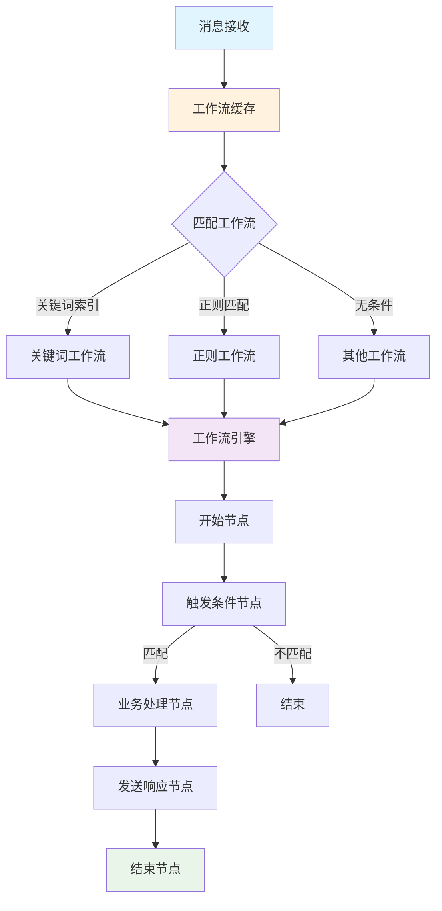
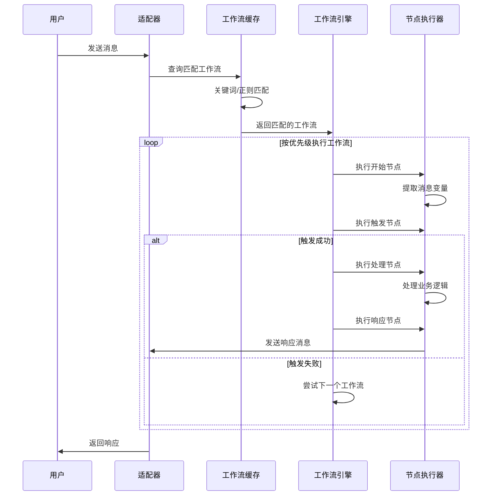

# 🎯 工作流开发文档

欢迎使用QQ机器人工作流系统！本文档将指导您开发灵活强大的消息处理工作流。

## 📋 目录

- [工作流简介](#工作流简介)
- [工作流架构](#工作流架构)
- [触发类型](#触发类型)
- [快速开始](#快速开始)
- [节点类型](#节点类型)
- [代码片段开发](#代码片段开发)
- [用户订阅系统](#用户订阅系统)
- [最佳实践](#最佳实践)
- [调试指南](#调试指南)
- [常见问题](#常见问题)

## 🎯 工作流简介

### 什么是工作流？

工作流（Workflow）是一种**可视化、低代码**的消息处理方式，通过拖拽连接不同的节点来实现复杂的机器人逻辑。

### 工作流 vs 传统插件

| 特性 | 工作流 | 传统插件 |
|------|--------|---------|
| **开发方式** | 可视化拖拽 + 代码片段 | 纯代码开发 |
| **学习成本** | 低，适合非开发人员 | 高，需要Python经验 |
| **灵活性** | 高，节点可自由组合 | 高，完全自定义 |
| **维护性** | 优秀，可视化流程清晰 | 一般，需要阅读代码 |
| **适用场景** | 快速实现常见功能 | 复杂的业务逻辑 |
| **性能** | 内存缓存，快速匹配 | 按优先级执行 |

### 核心优势

✅ **零代码起步** - 使用内置节点即可实现大部分功能  
✅ **可视化流程** - 流程一目了然，易于维护  
✅ **灵活扩展** - 支持Python代码片段自定义逻辑  
✅ **高性能** - 智能缓存和索引，快速匹配消息  
✅ **多协议支持** - 同时支持QQ官方、OneBot、KOOK协议

## 🏗️ 工作流架构

### 系统架构图



### 工作流执行流程



### 缓存系统

工作流系统采用**智能内存缓存**，避免每次消息都查询数据库：

- **启动加载** - 应用启动时加载所有工作流到内存
- **智能索引** - 根据触发类型建立缓存索引，减少匹配开销
- **自动刷新** - 编辑工作流时自动更新缓存
- **手动刷新** - 支持手动刷新缓存接口

## ⏰ 触发类型

工作流支持两种触发方式：

### 消息触发（默认）

当用户发送消息时，根据关键词、正则等条件匹配并执行工作流。

- **适用场景**：响应用户消息、命令处理、自动回复
- **执行时机**：收到消息时立即匹配
- **配置方式**：在工作流详情页选择"消息触发"

### 定时触发

使用 Cron 表达式定时执行工作流，无需用户发送消息。

- **适用场景**：定时推送、整点报时、定期提醒、数据统计
- **执行时机**：按 Cron 表达式定义的时间执行
- **配置方式**：在工作流详情页选择"定时触发"，填写 Cron 表达式

#### Cron 表达式格式

```
分 时 日 月 周
```

| 字段 | 取值范围 | 说明 |
|------|----------|------|
| 分 | 0-59 | 分钟 |
| 时 | 0-23 | 小时（24小时制） |
| 日 | 1-31 | 日期 |
| 月 | 1-12 | 月份 |
| 周 | 0-6 | 星期（0=周日） |

#### 常用 Cron 示例

```
0 * * * *       每整点执行（整点报时）
0 8 * * *       每天早上8点
0 8,12,18 * * * 每天8点、12点、18点
*/5 * * * *     每5分钟
0 9 * * 1       每周一早上9点
0 0 1 * *       每月1日凌晨
30 7 * * 1-5    工作日早上7:30
```

#### 定时工作流的特殊变量

定时触发的工作流，开始节点会提供以下变量：

```python
message           # 形如 "[定时任务: 工作流名]"
user_id           # 通常为空
group_id          # 通常为空
protocol          # 当前执行 bot 的协议
bot_id            # 当前执行 bot 的 ID
```

**注意**：定时工作流会对“订阅该工作流且在线”的 bot 分别执行一次，不会自动注入订阅用户的 `user_id`。

## 🚀 快速开始

### 1. 创建第一个工作流

访问后台管理 → 工作流管理 → 创建工作流

**基本信息：**
- 名称：回声工作流
- 描述：重复用户发送的消息
- 优先级：100（数字越小优先级越高）

### 2. 添加节点

```
[开始] → [关键词] → [代码片段] → [结束]
```

**节点配置：**

1. **开始节点**（自动添加）
   - 提取消息内容、发送者信息等

2. **关键词触发节点**
   - 关键词：`echo`, `回声`
   - 匹配模式：包含

3. **Python代码片段节点**
   - 选择代码片段：`echo_message.py`
   - 或自定义代码逻辑

4. **结束节点**（自动添加）
   - 允许继续执行：否

### 3. 保存并测试

保存工作流后，向机器人发送 "echo 你好"，机器人将回复你发送的内容。

### 4. 执行路径规则（重要）

当前工作流引擎按**显式跳转字段**执行，不再按节点数组顺序自动兜底：

- 通用跳转：`next_node`
- 条件分支：`true_branch` / `false_branch`
- 循环入口：`loop_body`

建议：除 `end` 节点外，所有业务节点都明确配置下一跳；未配置时流程通常会在该节点终止。

## 📦 节点类型

### 核心节点

#### 1. 开始节点 (start)

**功能**：工作流入口，自动提取消息信息

**输出变量**：
```python
message           # 消息内容（纯文本）
message_full      # 完整消息对象
message_type      # 消息类型（text/image/voice/video）
has_image         # 是否包含图片
has_at            # 是否包含@
user_id           # 发送者ID
sender.user_id    # 发送者ID
sender.nickname   # 发送者昵称
sender            # 完整sender对象
group_id          # 群ID（仅群聊）
message_id        # 消息ID
is_group          # 是否群聊
protocol          # 协议类型（qq/onebot/kook）
bot_id            # 机器人ID
event             # 完整事件对象
raw_data          # 消息原始数据（包含回复信息等）
```

**raw_data 常用嵌套访问**：
```python
raw_data.message[0].data.id    # 被回复消息的ID（当消息是回复时）
raw_data.message[0].type       # 第一个消息段类型
```

#### 2. 结束节点 (end)

**功能**：工作流出口，标记流程结束

**配置项**：
- `allow_continue`: 是否允许其他工作流继续处理（默认：true）

---

### 触发节点

#### 1. 关键词触发 (keyword_trigger)

**功能**：检查消息是否包含指定关键词，不匹配时自动中断工作流

**配置项**：
- `keywords`: 关键词列表，**每行一个**
- `match_type`: 匹配模式
  - `contains`: 包含（默认）
  - `equals`: 完全匹配
  - `starts_with`: 开头匹配
- `next_node`: 匹配成功后跳转节点ID（建议填写）

**输出变量**：
- `matched`: 是否匹配 (boolean)
- `keyword`: 匹配的关键词 (string)

**示例**：
```json
{
  "type": "keyword_trigger",
  "config": {
    "keywords": "天气\nweather\n查天气",
    "match_type": "contains",
    "next_node": "node_2"
  }
}
```

#### 2. 条件判断 (condition)

**功能**：根据条件判断执行不同分支

**简单模式配置项**：
- `mode`: `simple`
- `variable_name`: 要检查的变量名（支持点号访问嵌套变量，如 `response_json.code`）
- `condition_type`: 运算符
  - `equals`: 等于
  - `not_equals`: 不等于
  - `contains`: 包含
  - `not_contains`: 不包含
  - `starts_with`: 开头是
  - `ends_with`: 结尾是
  - `greater_than`: 大于
  - `less_than`: 小于
  - `is_empty`: 为空
  - `is_not_empty`: 不为空
  - `regex`: 正则匹配
- `compare_value`: 比较值（`regex` 时为正则表达式）
- `true_branch`: 满足条件跳转的节点ID（必填）
- `false_branch`: 不满足条件跳转的节点ID（必填）

**高级模式配置项**：
- `mode`: `advanced`
- `logic_type`: `AND` 或 `OR`
- `conditions`: 条件列表，每行格式：`变量名|运算符|比较值`。建议变量名使用模板语法，如 `{{response_json.code}}|equals|200`

**输出变量**：
- `result`: 判断结果 (boolean)

**示例**：
```json
{
  "type": "condition",
  "config": {
    "mode": "simple",
    "variable_name": "sender.user_id",
    "condition_type": "equals",
    "compare_value": "93653142",
    "true_branch": "node_2",
    "false_branch": "node_3"
  }
}
```

---

### 消息节点

#### 1. 发送消息 (send_message)

**功能**：发送消息给用户

**配置项**：
- `message_type`: 消息类型
  - `text`: 纯文本（所有协议）
  - `image`: 图片（所有协议）
  - `video`: 视频（所有协议）
  - `voice`: 语音（所有协议）
  - `file`: 文件（仅QQ官方，OneBot需用 endpoint 节点调用 `upload_group_file`）
  - `markdown`: Markdown（仅QQ官方）
  - `ark`: ARK卡片（仅QQ官方）
- `content`: 消息内容，支持 `{{variable_name}}` 模板
- `markdown_template_id`: Markdown模板ID（markdown类型时使用，群/私聊必填）
- `keyboard_id`: 按钮ID（markdown类型时可选）
- `ark_template_id`: ARK模板ID（ark类型时使用，如 23/24/37）
- `skip_if_unsupported`: 协议不支持时是否跳过（默认 true）
- `next_node`: 执行后跳转的节点ID（建议填写；留空可能终止流程）

**示例**：
```json
{
  "type": "send_message",
  "config": {
    "message_type": "text",
    "content": "你好，{{sender.nickname}}！你发送了：{{message}}",
    "skip_if_unsupported": false
  }
}
```

---

### 数据处理节点

#### 1. 设置变量 (set_variable)

**功能**：设置或修改上下文变量

**配置项**：
- `variable_name`: 变量名
- `variable_value`: 变量值，支持模板

**示例**：
```json
{
  "type": "set_variable",
  "config": {
    "variable_name": "greeting",
    "variable_value": "Hello {{sender.nickname}}"
  }
}
```

#### 2. 字符串处理 (string_operation)

**功能**：对字符串进行处理操作

**配置项**：
- `input`: 输入变量名（如 `message`、`douyin_text`）
- `operation`: 操作类型
  - `trim`: 去除首尾空格
  - `upper`: 转大写
  - `lower`: 转小写
  - `replace`: 替换（需要 param1 和 param2）
  - `substring`: 截取子串（param1 格式：`开始,结束`）
  - `split`: 分割（param1 为分隔符）
  - `regex_extract`: 正则提取（param1 为正则表达式，返回第一个捕获组或完整匹配）
  - `regex_replace`: 正则替换（param1 为正则表达式，param2 为替换内容，支持 `\1` 反向引用）
- `param1`: 参数1
- `param2`: 参数2
- `save_to`: 保存到的变量名

**输出变量**：
- `output`: 处理后的字符串

**正则提取示例**：
```json
{
  "type": "string_operation",
  "config": {
    "input": "message",
    "operation": "regex_extract",
    "param1": "https://v\\.douyin\\.com/[^\\s]+",
    "save_to": "douyin_url"
  }
}
```

#### 3. JSON提取 (json_extract)

**功能**：从JSON中提取指定字段

**配置项**：
- `json_source`: JSON源变量名
  - `response_json`: HTTP请求响应
  - `endpoint_response`: 自定义端点响应
  - `raw_data`: 消息原始数据
  - `message`: 消息内容
- `extract_path`: 提取路径，如 `data.user.name` 或 `items[0].id`（留空则取整个对象）
- `save_to`: 保存到的变量名
- `default_value`: 默认值（提取失败时使用）

**示例**：
```json
{
  "type": "json_extract",
  "config": {
    "json_source": "response_json",
    "extract_path": "data.temperature",
    "save_to": "temp",
    "default_value": "未知"
  }
}
```

---

### 网络节点

#### 1. HTTP请求 (http_request)

**功能**：发送HTTP请求到外部API

**配置项**：
- `method`: 请求方法：`GET`, `POST`, `PUT`, `DELETE`
- `url`: 请求URL，支持模板
- `headers`: JSON格式的请求头（可选）
- `body`: 请求体（POST/PUT时使用）
- `timeout`: 超时时间（秒），默认10
- `response_type`: 响应类型：`auto`, `json`, `text`

**输出变量**：
- `response_status`: HTTP状态码
- `response_text`: 响应文本
- `response_json`: JSON响应（如果是JSON）
- `response_success`: 是否成功（状态码<400）
- `response_error`: 错误信息

**示例**：
```json
{
  "type": "http_request",
  "config": {
    "method": "GET",
    "url": "https://api.example.com/user/{{user_id}}",
    "headers": "{\"Authorization\": \"Bearer token\"}",
    "timeout": "10",
    "response_type": "json"
  }
}
```

---

### 动作节点

#### 1. 自定义端点 (endpoint)

**功能**：调用OneBot协议的任意API端点（仅OneBot协议）

**配置项**：
- `action`: API端点名称，如 `send_msg`, `delete_msg`, `set_group_card`
- `params`: JSON格式的请求参数，支持模板（可使用点号访问嵌套变量如 `{{response_json.data.url}}`）
- `enable_template`: 是否启用变量替换（默认 true）
- `next_node`: 执行后跳转的节点ID（建议填写；留空可能终止流程）

**输出变量**：
- `endpoint_response`: API响应结果（直接是数据本体，不像HTTP节点有 status/retcode/data 包裹）
- `endpoint_success`: 是否成功
- `endpoint_error`: 错误信息

**与 HTTP 节点的区别**：
- HTTP 节点调用 OneBot HTTP API，响应格式为 `{status, retcode, data: {...}}`，需用 `extract_path: "data"` 提取
- endpoint 节点走 WebSocket API，响应直接是数据本体，无需提取 data

**示例**：
```json
{
  "type": "endpoint",
  "config": {
    "action": "get_msg",
    "params": "{\"message_id\": {{reply_id}}}",
    "enable_template": true
  }
}
```

#### 2. HTML渲染 (html_render)

**功能**：将HTML模板渲染为图片

**配置项**：
- `template_path`: 模板文件名（Render目录下）
- `template_data`: JSON格式的模板数据，支持模板
- `width`: 图片宽度（像素），留空自适应
- `height`: 图片高度（像素），留空自适应

**输出变量**：
- `image_base64`: 图片Base64数据
- `render_success`: 渲染是否成功

**示例**：
```json
{
  "type": "html_render",
  "config": {
    "template_path": "user_card.html",
    "template_data": "{\"name\": \"{{sender.nickname}}\"}",
    "width": "450",
    "height": ""
  }
}
```

**发送渲染的图片**：
```json
{
  "type": "send_message",
  "config": {
    "message_type": "image",
    "content": "base64://{{image_base64}}"
  }
}
```

---

### 时间节点

#### 1. 延迟等待 (delay)

**功能**：暂停指定时间后继续执行

**配置项**：
- `delay_seconds`: 延迟时间（秒），支持小数

**示例**：
```json
{
  "type": "delay",
  "config": {
    "delay_seconds": "1.5"
  }
}
```

#### 2. 获取时间 (timestamp)

**功能**：获取当前时间信息

**配置项**：
- `format`: 日期格式，默认 `%Y-%m-%d %H:%M:%S`

**输出变量**：
- `timestamp`: Unix时间戳
- `datetime`: 格式化日期时间
- `date`: 日期
- `time`: 时间
- `year`, `month`, `day`, `hour`, `minute`: 各时间分量
- `weekday`: 星期几

#### 3. 时间段检查 (schedule_check)

**功能**：检查当前时间是否在指定时间段内

**配置项**：
- `start_time`: 开始时间（HH:MM）
- `end_time`: 结束时间（HH:MM）
- `weekdays_only`: 仅工作日

**输出变量**：
- `in_schedule`: 是否在时间段内
- `current_time`: 当前时间

---

### 协议节点

#### 1. 协议检查 (protocol_check)

**功能**：检查当前使用的协议类型

**配置项**：
- `target_protocol`: 目标协议（可选）：`qq` 或 `onebot`

**输出变量**：
- `protocol`: 协议名称
- `is_qq`: 是否QQ官方
- `is_onebot`: 是否OneBot

---

### 工具节点

#### 1. 注释 (comment)

**功能**：添加注释说明，不执行任何操作

**配置项**：
- `comment`: 注释内容

#### 2. Python代码片段 (python_snippet)

**功能**：执行预定义的Python代码片段

**配置项**：
- `snippet_name`: 代码片段文件名（Snippets目录下）

**输出变量**：
- `result`: 代码执行结果

**可用变量**：
```python
# 从 context 获取变量
message = context.get_variable('message')
user_id = context.get_variable('sender.user_id')

# 发送消息
message_api = context.get_variable('message_api')
message_api.send_message('回复内容')

# 设置变量给后续节点使用
context.set_variable('my_variable', 'value')
```

## 💻 代码片段开发

### 代码片段简介

代码片段（Snippet）是存储在 `Snippets/` 目录下的Python文件，用于实现自定义逻辑。

### 创建代码片段

1. 在 `Snippets/` 目录创建 `.py` 文件
2. 参考 `_template.py` 模板文件
3. 编写处理逻辑

### Context 对象完整 API

在代码片段中，你可以通过 `context` 对象访问所有功能。

#### 属性

```python
# 事件对象
context.event                          # BaseEvent 对象，包含完整的消息事件信息

# 变量字典
context.variables                       # dict，存储所有工作流变量
```

#### 事件对象方法

```python
# 获取消息内容
context.event.get_plaintext()          # -> str: 获取纯文本消息内容
context.event.get_message()            # -> BaseMessage: 获取完整消息对象

# 获取发送者信息
context.event.get_user_id()            # -> str: 获取发送者用户ID
context.event.get_session_id()         # -> str: 获取会话ID（群聊/私聊）

# 判断消息类型
context.event.is_tome()                # -> bool: 消息是否@了机器人
context.event.get_type()               # -> str: 获取事件类型（message/notice/request）
context.event.get_event_name()         # -> str: 获取事件名称
```

#### Context 核心方法

```python
# 变量管理
context.get_variable(key, default=None)     # 获取变量
context.set_variable(key, value)            # 设置变量

# 响应消息
context.set_response(message)               # 设置响应消息（自动标记为已处理）
context.get_response()                      # 获取当前响应消息
context.clear_response()                    # 清除响应消息

# 模板渲染
context.render_template(template_str)      # 使用Jinja2渲染模板字符串
```

#### 快捷方法示例

```python
# 快速发送文本消息
message_api = context.variables['message_api']
message_api.send_message('你好！')          # 发送文本
message_api.reply('你好！')                  # reply 是 send_message 的别名

# 获取开始节点提取的变量
message = context.get_variable('message')            # 消息文本
user_id = context.get_variable('sender.user_id')    # 发送者ID
nickname = context.get_variable('sender.nickname')  # 发送者昵称
group_id = context.get_variable('group_id')         # 群ID（如果是群聊）
is_group = context.get_variable('is_group')         # 是否群聊
```

### 代码片段模板

```python
# Name: 片段名称
# Description: 片段描述
# Author: 作者
# Version: 1.0.0

# 从上下文获取变量
message = context.get_variable('message', '')
user_id = context.get_variable('sender.user_id', '')
is_group = context.get_variable('is_group', False)

# 获取消息API
message_api = context.get_variable('message_api')

# 处理逻辑
if message.startswith('你好'):
    # 发送回复
    message_api.send_message('你好啊！')
    
    # 设置变量给后续节点
    context.set_variable('greeted', True)
    result = '已发送问候'
else:
    result = '未触发问候'
```

### 可用API

#### 1. 获取变量

```python
# 基础用法
value = context.get_variable('key')

# 带默认值
value = context.get_variable('key', default='')

# 获取嵌套变量（支持点号表示法访问任意深度）
nickname = context.get_variable('sender.nickname')
code = context.get_variable('response_json.code')  # 访问HTTP响应中的JSON字段
video_url = context.get_variable('response_json.data.video_url')  # 多级嵌套
```

**嵌套访问说明**：点号表示法会自动解析嵌套的字典或对象属性。例如 `response_json.data.title` 等价于 `response_json['data']['title']`。

#### 2. 设置变量

```python
# 设置简单值
context.set_variable('key', 'value')

# 设置复杂对象
context.set_variable('user_data', {'name': 'Alice', 'level': 5})
```

#### 3. 发送消息

```python
# 获取消息API
message_api = context.get_variable('message_api')

# 发送文本消息
message_api.send_message('Hello World')

# 发送消息对象
from Core.message.builder import MessageBuilder
message_api.send_message(MessageBuilder.text('Hello'))
message_api.send_message(MessageBuilder.markdown('# Title'))
```

### 内置代码片段

系统提供了一些内置代码片段供参考：

#### echo_message.py
```python
# Name: 消息回显
# Description: 回显消息详细信息，用于调试和测试

# 获取所有相关变量
message = context.get_variable('message', '')
message_type = context.get_variable('message_type', 'unknown')
user_id = context.get_variable('sender.user_id', '')
sender_name = context.get_variable('sender.nickname', '未知')
group_id = context.get_variable('group_id', '')
is_group = context.get_variable('is_group', False)
protocol = context.get_variable('protocol', 'unknown')

# 构造详细信息
info_lines = [
    f"━━━ 消息回显 ━━━",
    f"👤 发送者: {sender_name} ({user_id})",
]

if is_group:
    info_lines.append(f"👥 群聊: {group_id}")
else:
    info_lines.append(f"💬 私聊")

info_lines.extend([
    f"📡 协议: {protocol}",
    f"📝 类型: {message_type}",
    f"━━━ 消息内容 ━━━",
    message,
])

# 发送回显信息
message_api = context.get_variable('message_api')
if message_api:
    reply = '\n'.join(info_lines)
    message_api.send_message(reply)
    result = f"已回显 {sender_name} 的消息详情"
else:
    result = "无法发送消息"
```

#### specific_user_reply.py
```python
# Name: 特定用户回复
# Description: 仅对指定用户ID回复消息

# 配置
TARGET_USER_ID = "93653142"  # 修改为目标用户ID

# 获取变量
user_id = context.get_variable('sender.user_id', '')
message = context.get_variable('message', '')

# 检查是否为目标用户
if user_id == TARGET_USER_ID:
    message_api = context.get_variable('message_api')
    message_api.send_message(f'收到你的消息：{message}')
    result = '已回复目标用户'
else:
    result = '非目标用户，跳过'
```

## 👥 用户订阅系统

工作流采用**用户订阅机制**，只有订阅了工作流的用户才会收到该工作流的响应。

### 工作原理

#### 消息触发工作流

1. 用户发送消息
2. 系统获取消息所属 Bot 的 owner（管理员）
3. 查找该用户订阅且启用的工作流
4. 仅匹配和执行订阅的工作流

#### 定时触发工作流

1. 到达 Cron 计划时间
2. 查询所有订阅该工作流的用户
3. 为每个订阅用户执行一次工作流
4. 分别发送消息给各用户

### 用户如何订阅

用户访问 **用户中心 → 工作流商店** 页面：

1. 浏览可用的公开工作流
2. 点击"订阅"按钮添加到自己的工作流列表
3. 在"我的订阅"中管理已订阅的工作流
4. 可以启用/禁用单个工作流

### 协议过滤

工作流可以限制仅在特定协议下执行：

- **QQ官方协议** (`qq`)
- **OneBot协议** (`onebot`)
- **KOOK协议** (`kook`)
- **不限制**：留空或同时勾选全部协议

配置位置：工作流详情页 → 允许的协议

### 订阅相关数据模型

```python
# UserWorkflow 表
user_id       # 用户ID
workflow_id   # 工作流ID
enabled       # 是否启用
subscribed_at # 订阅时间
```

## 🎨 最佳实践

### 1. 工作流设计原则

#### 单一职责
每个工作流专注一个功能领域：

✅ **好的设计**：
- 工作流1：处理天气查询
- 工作流2：处理音乐点歌
- 工作流3：处理签到功能

❌ **避免的设计**：
- 工作流1：处理所有命令（过于复杂）

#### 优先级规划

```
安全检查工作流     优先级: 1  （最先执行）
管理员命令工作流   优先级: 5
普通功能工作流     优先级: 10-50
帮助信息工作流     优先级: 100（最后执行）
```

### 2. 触发条件优化

#### 使用关键词触发

适合场景：固定的命令或关键词

```json
{
  "keywords": "天气\nweather\n/weather",
  "match_type": "contains",
  "next_node": "node_2"
}
```

**优势**：配置简单、命中快，适合固定口令类场景

#### 使用正则条件判断

适合场景：消息格式复杂，需要提取结构化内容

```json
{
  "mode": "simple",
  "variable_name": "message",
  "condition_type": "regex",
  "compare_value": "^查询\\s+(.+)\\s+的(.+)$",
  "true_branch": "node_2",
  "false_branch": "end"
}
```

**注意**：正则匹配较慢，仅在必要时使用

### 3. 代码片段最佳实践

#### 错误处理

```python
try:
    # 你的代码
    user_id = context.get_variable('sender.user_id')
    message_api = context.get_variable('message_api')
    message_api.send_message('处理成功')
    result = '成功'
except Exception as e:
    result = f'错误: {str(e)}'
```

#### 变量验证

```python
# 获取变量前先验证
message = context.get_variable('message', '')
if not message:
    result = '消息为空'
else:
    # 处理消息
    result = '处理完成'
```

#### 资源管理

```python
# 使用文件时记得关闭
try:
    with open('data.json', 'r') as f:
        data = json.load(f)
    result = '读取成功'
except:
    result = '读取失败'
```

### 4. 性能优化建议

#### 避免阻塞操作

```python
# ❌ 避免长时间阻塞
import time
time.sleep(10)  # 不要这样做

# ✅ 如需等待，使用异步或后台任务
import threading

def background_task():
    # 耗时操作
    pass

thread = threading.Thread(target=background_task)
thread.start()
```

#### 缓存重复计算

```python
# ✅ 缓存结果避免重复计算
cache = {}

def get_data(key):
    if key not in cache:
        cache[key] = expensive_operation(key)
    return cache[key]
```

## 🐛 调试指南

### 1. 查看工作流日志

工作流执行时会产生详细日志：

```
[DEBUG] 尝试执行工作流: Yapi (优先级: 10)
[DEBUG] 执行节点: start (start)
[DEBUG] 执行节点: keyword_1 (keyword)
[DEBUG] 节点执行结果: {'success': True, 'matched': True}
```

### 2. 使用Echo片段调试

创建测试工作流，使用 `echo_message.py` 片段查看所有可用变量：

```
[开始] → [关键词:debug] → [echo_message片段] → [结束]
```

发送 "debug" 即可看到完整的消息信息。

### 3. 添加调试输出

在代码片段中添加print语句：

```python
print(f"[DEBUG] 消息内容: {message}")
print(f"[DEBUG] 用户ID: {user_id}")
print(f"[DEBUG] 是否群聊: {is_group}")
```

### 4. 查看系统日志

工作流执行日志记录在 `logs/` 目录下，可以通过后台管理查看。

## ❓ 常见问题

### Q: 工作流不执行？

**A:** 检查以下几点：

1. 工作流是否启用
2. 触发条件是否正确配置
3. 优先级是否被其他工作流抢占
4. 查看日志了解匹配情况

### Q: 代码片段报错？

**A:** 常见错误：

```python
# ❌ 变量不存在
value = context.get_variable('not_exist')  # 可能返回None

# ✅ 使用默认值
value = context.get_variable('not_exist', default='')

# ✅ 检查变量是否存在
value = context.get_variable('key')
if value is not None:
    # 处理
    pass
```

### Q: 如何实现多轮对话？

**A:** 当前版本暂不支持会话状态管理，推荐使用代码片段配合Redis或文件存储：

```python
import json
import os

# 简单的状态存储
STATE_FILE = 'states.json'

def load_state(user_id):
    if os.path.exists(STATE_FILE):
        with open(STATE_FILE, 'r') as f:
            states = json.load(f)
            return states.get(user_id)
    return None

def save_state(user_id, state):
    states = {}
    if os.path.exists(STATE_FILE):
        with open(STATE_FILE, 'r') as f:
            states = json.load(f)
    
    states[user_id] = state
    with open(STATE_FILE, 'w') as f:
        json.dump(states, f)
```

### Q: 工作流和插件能共存吗？

**A:** 完全可以！两者互不干扰：

- 工作流按优先级执行
- 插件也按优先级执行
- 可以通过 `continue` 配置控制是否继续执行

### Q: 如何更新缓存？

**A:** 缓存会自动更新，也可以手动刷新：

- **自动更新**：编辑、启用、禁用工作流时
- **手动刷新**：仪表盘点击"重载工作流缓存"按钮
- **API刷新**：`POST /admin/workflows/reload`

### Q: 性能如何？

**A:** 工作流系统性能优异：

- **关键词匹配**：缓存索引命中后快速执行
- **复杂条件匹配**：按配置逐条判断，建议只在需要时使用
- **内存占用**：200个工作流约5MB
- **缓存预编译**：正则表达式提前编译

## 📚 参考资源

### 相关文档

- [传统插件开发文档](./plugin-development.md) - 了解插件系统
- [QQ官方API文档](https://bot.q.qq.com/wiki/) - QQ机器人API
- [OneBot文档](https://11.onebot.dev/) - OneBot协议标准
- [KOOK开发者文档](https://developer.kookapp.cn/) - KOOK机器人开发文档

### 示例工作流

系统提供了示例工作流供参考：

- **Echo工作流** - 消息回显
- **Yapi工作流** - API调用示例
- **回显消息工作流** - 调试工具

### 代码片段模板

查看 `Snippets/_template.py` 了解完整的代码片段模板和可用API。

---

🎉 **开始创建你的工作流吧！** 如有问题，请查看示例工作流或联系开发团队。
